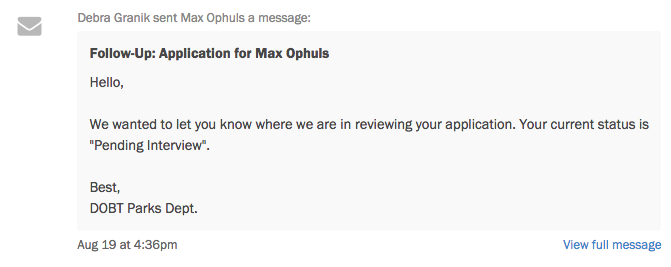
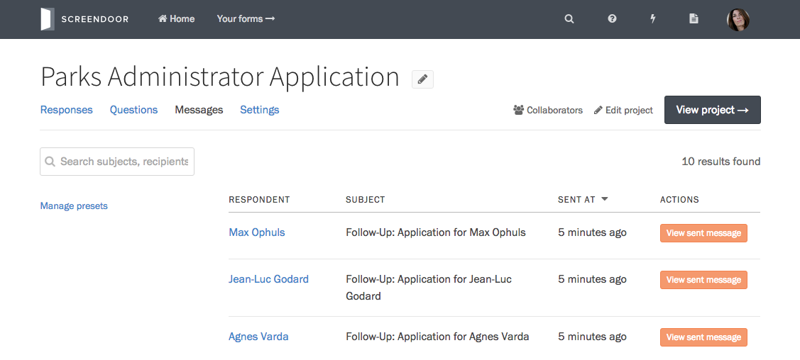

### Viewing messages sent to a response

To see all messages that have been sent to a response, click on that response in the table on the Responses page, and scroll down to the Discussion section. If a message has been sent to a response, it will be displayed in the same thread as your comments.

If a message is long, Screendoor will truncate it. Click the "View full message" link in the lower right-hand corner to view the entire message.

### Viewing all sent messages in a project

You can also see a log of all messages sent in a project. Visit the Messages page in your project to see the full list.

Press the "View full message" on the right side of the table to view the contents of the message.
