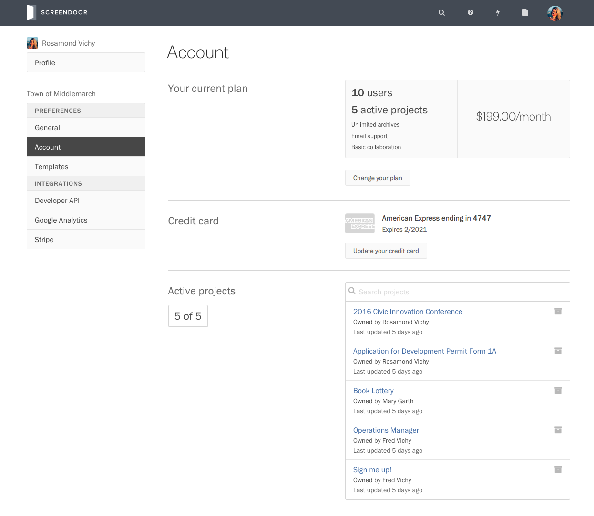
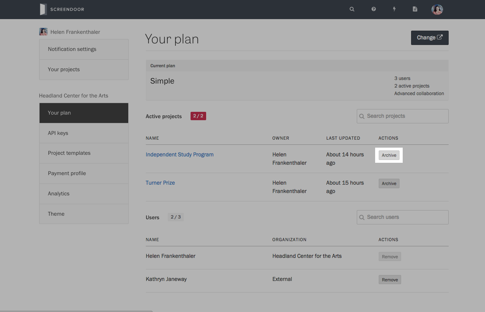
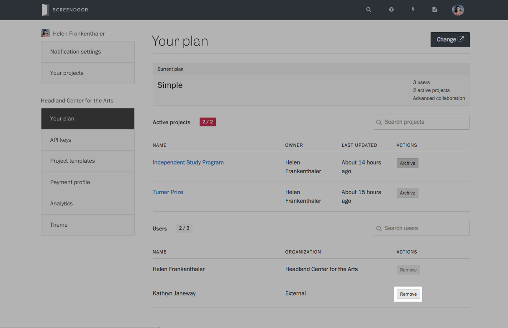
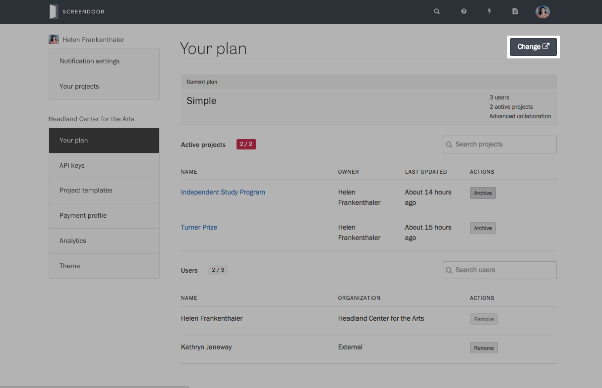

Depending on your plan, Screendoor will limit the following items:

| Item  | Description |
| ----- | ----- |
| Projects | The number of active projects allotted to your plan. [Archived projects](/articles/screendoor/projects/archiving_a_project.html) do not count against this limit. |
| Collaborators | The number of [collaborators](../collaboration/collaborators.html) allotted to your plan. If someone in your organization collaborates on multiple projects, they will only count as one collaborator. Collaborators for [archived projects](/articles/screendoor/projects/archiving_a_project.html) are not counted against your plan limit. |

Once you have reached the maximum amount of projects or collaborators, you won't be able to add more of them until you upgrade your plan, [remove collaborators](/articles/screendoor/collaboration/collaborators.html#removing-collaborators), or [archive some projects](/articles/screendoor/projects/archiving_a_project.html).

In addition, [e-signatures](../your_form/signatures.html), [teams](../collaboration/teams.html) and [Socrata sync](../integrations/socrata.html) are only available for advanced plans. See our [pricing page](https://www.dobt.co/screendoor/pricing/) for more information.

### Managing projects and collaborators

If you're an administrator in your organization, you can view the details of your plan and a list of active projects and collaborators. Click your avatar in the navigation bar and select ["Users and billing"](https://screendoor.dobt.co/settings/plan) from the dropdown. (Alternatively, if you're already on [the "Settings" page](https://screendoor.dobt.co/account/settings), select "Your plan" from the sidebar.)

You can archive projects directly from this page by pressing the "Archive" button next to a project's name.

To remove a collaborator from your plan, press the "Remove" button next to their name. Doing so will remove them from the projects they're a collaborator on. If they were the owner of a project, ownership of that project will be transferred to the owner of your organization.

If you want to upgrade your plan, press the "Change" button on the upper right-hand corner of the page.

