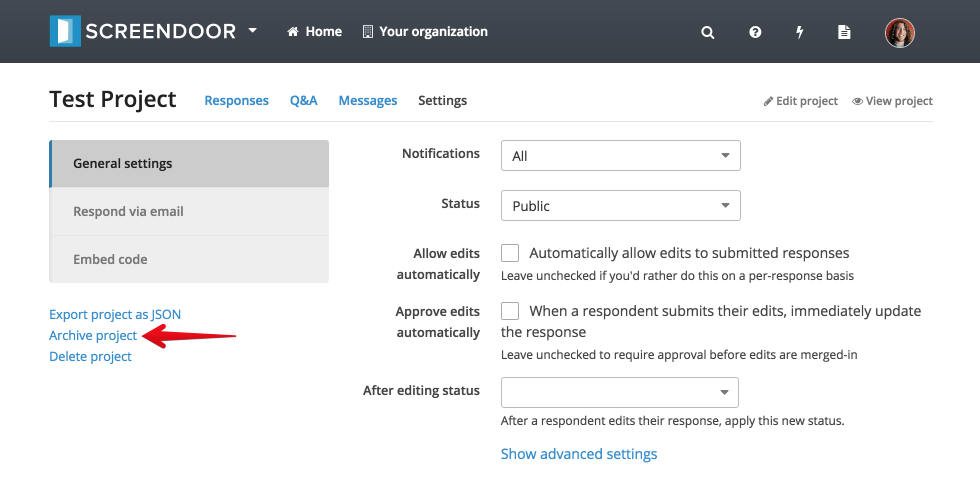
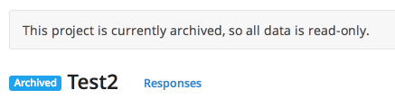

When a project isn't active anymore, you can archive it to keep your data safe. Archived projects are read-only, so you won't be able to make any changes or accept responses once you archive a project. However, you can always go back and unarchive a project.

> **Note**: Archived projects will *not* count towards your plan's project limit.

## Archiving a project

To archive a project, click the "Archive project" link from the bottom left-hand side of the "Settings" page for your project.

Your project is now archived! You'll see an "Archived" tag next to the name of your project, as well as a "This project is currently archived" alert. You'll still be able to view all your responses, as well as remove collaborators.

## Restoring a project

To restore an archived project, click the "Restore project" button. Your project will now be active again.

---

## Will my project page still be visible if my project is archived?
Archived projects will *not* show up on your organization's project listing page. However, if someone still has the URL for your project page, they will be able to view it (but not submit responses).
