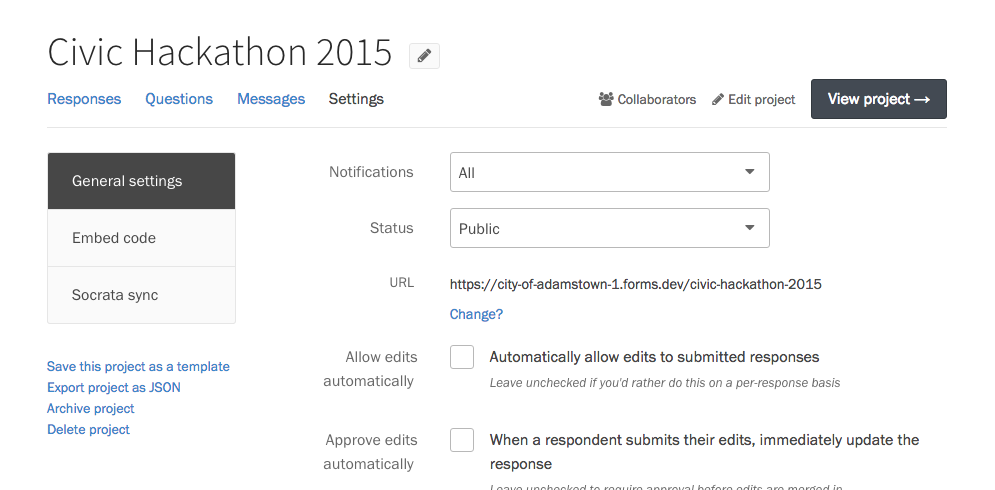
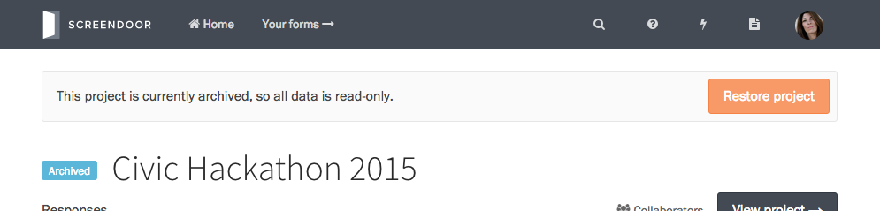

If you exceed the number of projects your plan allows, you can archive an inactive project to keep your data safe. Archived projects are read-only, so they don't count towards your plan's limits: you can't change an archived project's settings, add ratings and comments, or accept new submissions.

To archive a project, visit your project's Settings page, and select "Archive project" in the bottom left-hand corner.

Archived projects have a tag next to their title, to remind you of its status. If you want to restore an archived project, just press the "Restore project" button on the alert at the top of the page.

---

### F.A.Q.

#### Will my archived project's page still be publicly available?

If someone still has the link to your project page, they will be able to view it, but they won't be able to submit to your form. Archived projects are not linked to from your organization's project listings.
