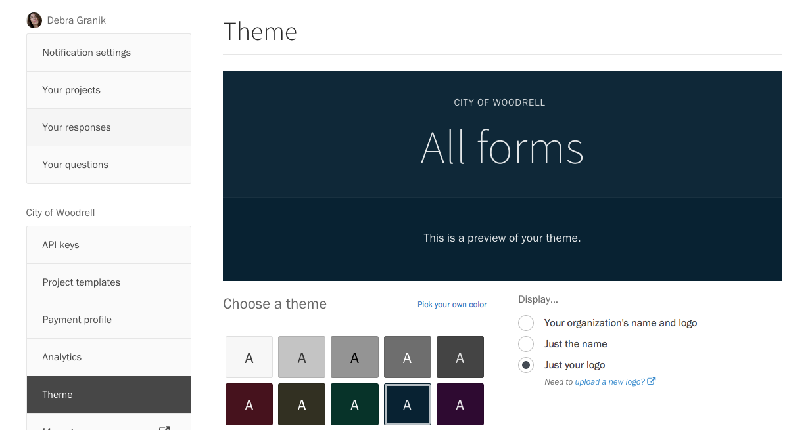

Your Screendoor account comes with a gorgeous landing page for your forms, along with your own `forms.fm` subdomain. You can make this page your own: add your name and logo, and choose a custom background color for your forms.

To start, click on your avatar in the navigation bar. Select "Settings" from the dropdown, and choose "Theme" from the sidebar.

You can add your name and logo from this page, as well as a custom background color. Choose a color scheme from the grid by pressing it, or click the "Pick your own color" link to choose your own. Screendoor automatically picks a complementary text color that will comply with federal accessibility guidelines.

Make sure your changes look good by checking the preview pane at the top of the page. When you're ready, press the Save button to update your `forms.fm` page.
