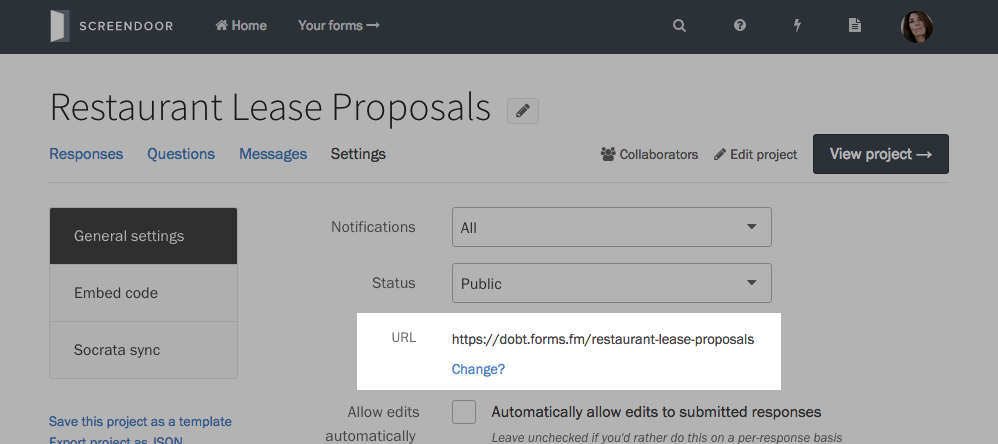
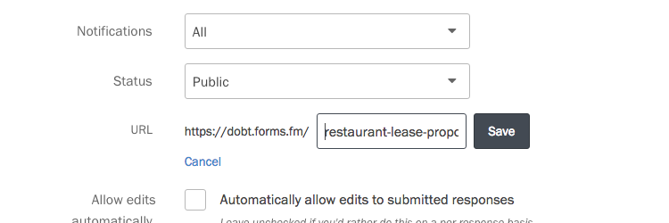

To change your project's Web address, go to your project's settings, and press the "Change?" link under its URL.

Enter a new URL, and press the Save button.

URLs can only contain letters, numbers, and hyphens.
