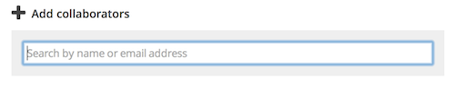

## Adding collaborators

You can add collaborators to your project when you create it, but you can also go back and add (as well as configure and remove) collaborators later. From the main project page, click "Edit project" and then select "Collaborators" from the "Project checklist" on the right-hand side of the page. From the collaborators page you can search for an individual to add by typing their name or email address in the search box under "Add collaborators." You can also invite someone to collaborate if they are not yet registered with your project. Make sure to select the appropriate permission level from the dropdown; note the explanations of each permission level under "Recommendations" on the collaborators page.

## Assigning permissions

You can always go back and change permissions for a collaborator after you have added them. Simple select the new permissions level you wish to give a collaborator from the dropdown next to their name and email address on the "Collaborators" page.

## Custom permissions

If you need more control and configuration options for a collaborators permission level, you might want to use the "Custom" permission level. After you add a collaborator with a custom permission level (or change an existing collaborator's permission level to "Custom"), simply click the "Set permissions" link under the permissions dropdown on the "Collaborators" page. Just check or un-check specific boxes to set permissions for this collaborator. If you aren't sure which permissions to give a specific collaborator, you can always change their permissions back to one of the predefined permission levels.

## Removing collaborators

To remove a collaborator, simply click the "remove" link next to the collaborator you would like to remove. Note that this link only appears when you move your mouse over the collaborator.