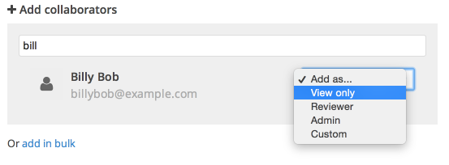
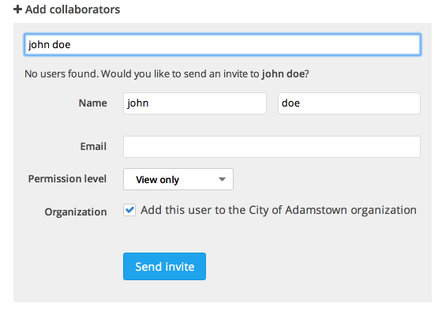
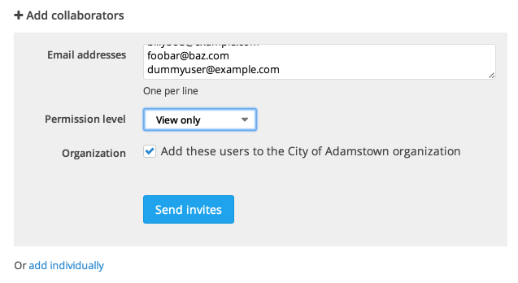
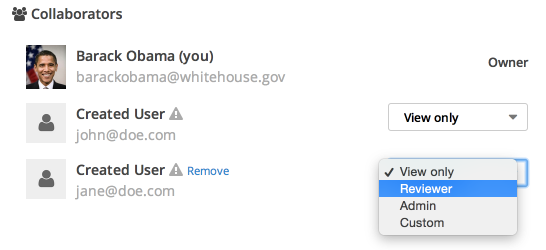

## Adding individual collaborators

You can add collaborators to your project when you first create it, but you can also go back and add (as well as configure and remove) collaborators later. From the main project page, click "Edit project" and select "Collaborators" from the Project Checklist on the right-hand side of the page. You can search for an individual to add by typing their name or email address into the search box under "Add collaborators."

If the person you are searching for is already registered and part of your organization, you'll see them come up in your search and can add them immediately. Make sure to select the appropriate permission level from the dropdown (note the explanations of each permission level under "Recommendations").

You can also invite someone to collaborate if they are not yet registered with your project. Just enter their email address, select a permission level, choose whether or not to add them to your organization, and click "Send invite."

## Adding collaborators in bulk

To add collaborators in bulk, click "Add in bulk" and enter the email addresses of the collaborators you'd like to invite (one per line). Then, select the appropriate permission level, choose whether or not to add them to your organization, and click "Send invites."

## Allowing all organization members to collaborate

If you want to allow individuals who are already members of your organization (but have not been added as collaborators to your project) to collaborate, simply select the appropriate organization-wide permission level. This way, you don't have to manually add everyone who is already a part of your organization every time you create a new project.

This will allow all members of your organization to collaborate, and give them the selected permission level.

> **Note**: Any permission level that you assign to a specific collaborator will override the organization-wide permission level.

If you want to revoke organization-wide access and only allow collaborators that you've added to access your project, simply select "None" as your organization-wide permission level.

## Assigning permissions to collaborators

You can always go back and change permissions for a collaborator after you have added them. Simply select the new permissions level you wish to give a collaborator from the dropdown next to their name and email address on the "Collaborators" page.

Here is a summary of the available permission levels:

- **View Only**: View-only users can see responses, no more.

- **Reviewer**: Reviewers can view, comment on, and rate responses. They can also change the status, add labels, and assign users to a response.

- **Admin**: Admins have all permissions.

## Custom permissions

If you need more control and configuration options for a collaborators permission level, you might want to use the "Custom" permission level. After you add a collaborator with a custom permission level (or change an existing collaborator's permission level to "Custom"), simply click the "Set permissions" link under the permissions dropdown on the "Collaborators" page. Just check or un-check specific boxes to set permissions for this collaborator. If you aren't sure which permissions to give a specific collaborator, you can always change their permissions back to one of the predefined permission levels.

## Removing collaborators

To remove a collaborator, simply click the "remove" link next to the collaborator you would like to remove. Note that this link only appears when you move your mouse over the collaborator.
