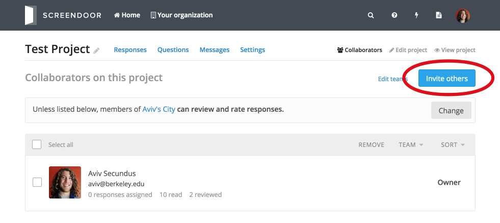
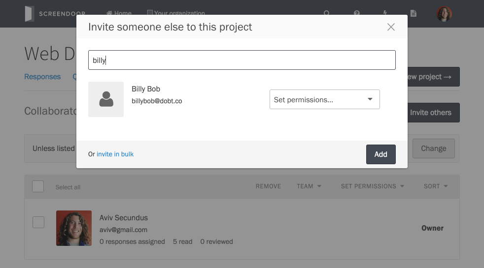
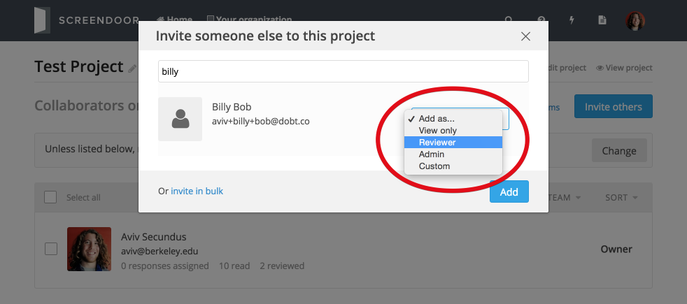
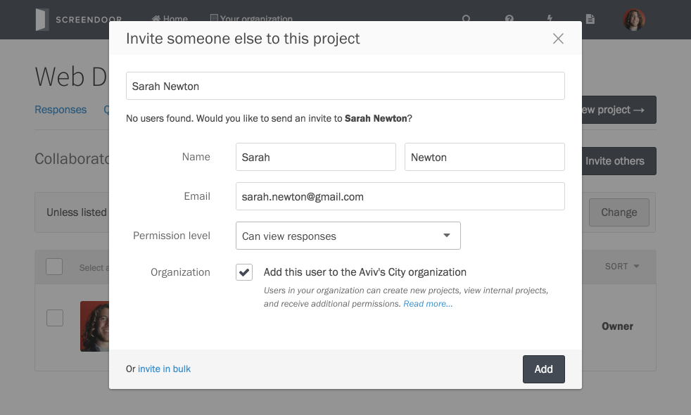
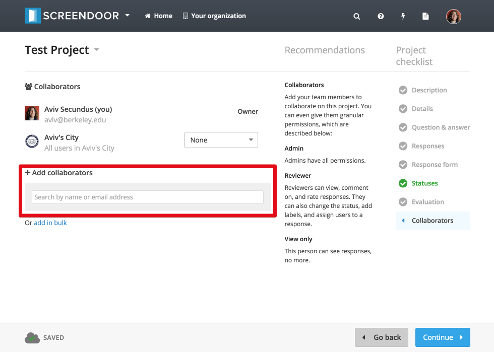
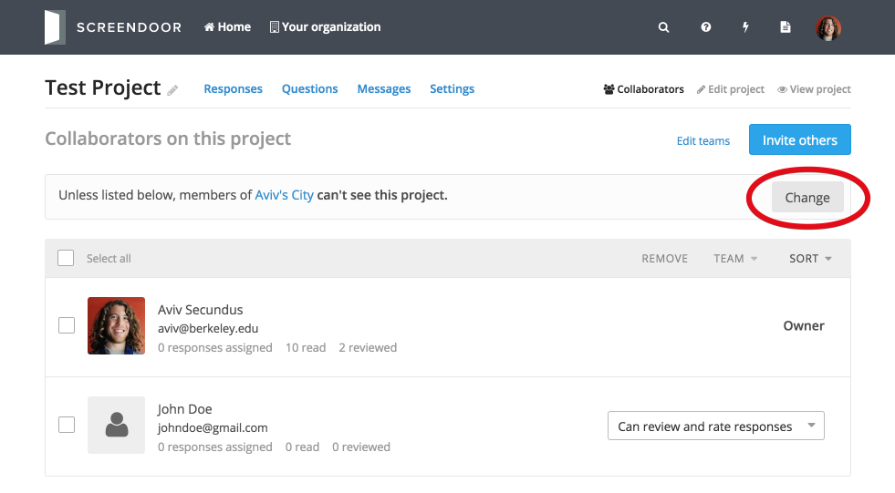
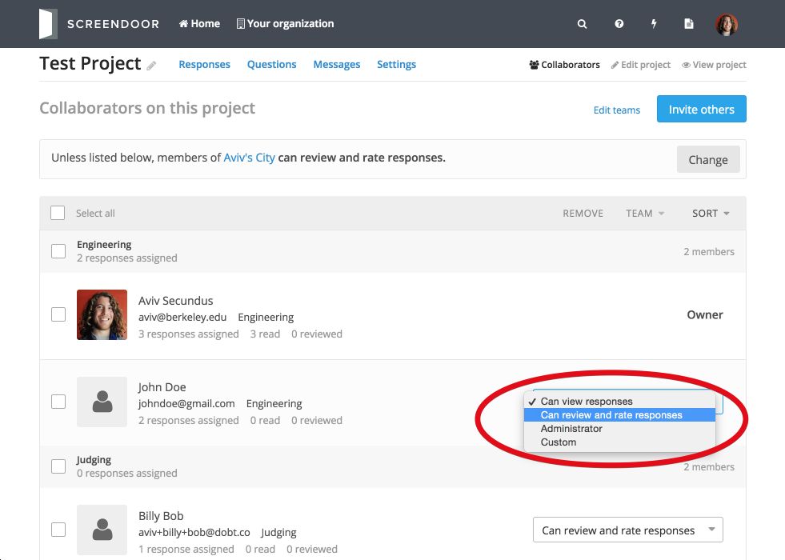
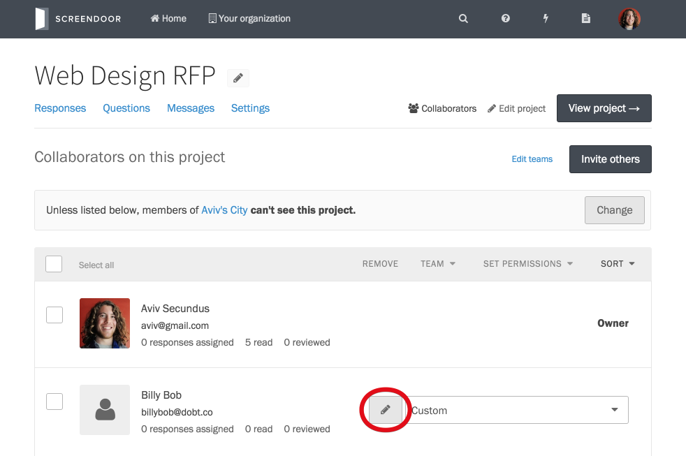
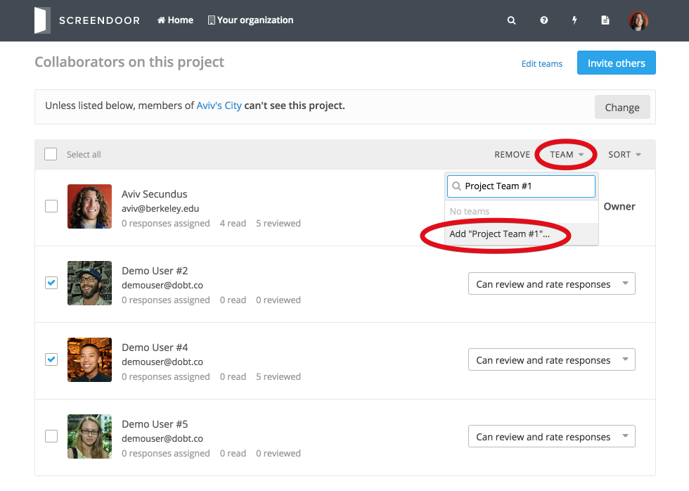

## Adding collaborators

To add collaborators to your project, navigate to the "Collaborators" page and click the "Invite others" button.

### Adding individual collaborators

You can search for an individual to add by typing their name or email address into the search box.

If the person you are searching for is already registered and part of your organization, you'll see them come up in your search and can add them immediately. Make sure to select the appropriate permission level from the dropdown.

You can also invite someone to collaborate if they are not yet registered with your project. Just enter their name and email address, select a permission level, choose whether or not to add them to your organization, and click "Add."

### Adding collaborators in bulk

To add collaborators in bulk, click "invite in bulk" and enter the email addresses of the collaborators you'd like to invite (one per line). Then, select the appropriate permission level, choose whether or not to add them to your organization, and click "Send invites."

## Allowing all organization members to collaborate

If you want to allow individuals who are already members of your organization (but have not been added as collaborators to your project) to collaborate, click "Change," select the appropriate permission level, and click "Save." This way, you don't have to manually add everyone who is already a part of your organization every time you create a new project.

This will allow all members of your organization to collaborate, and give them the selected permission level by default.

## Assigning permissions to collaborators

You can always go back and change permissions for a collaborator after you have added them. Simply select the new permissions level you wish to give a collaborator from the dropdown next to their name and email address on the "Collaborators" page.

Here is a summary of the available permission levels:

- **Can view responses**: View-only users can see responses, no more.

- **Can review assigned responses**: Users can review and rate responses assigned to them. They can't assign statuses or labels to responses.

- **Can review, label, assign all responses**: Users can view, comment on, and rate responses. They can also change the status, add labels, and assign users to a response.

- **Administrator**: Administrators have all permissions.

## Custom permissions

If you need more granular control and configuration options for a collaborator's permission level, use the "Custom" permission level. After you add a collaborator with a custom permission level (or change an existing collaborator's permission level to "Custom"), click the "edit" icon next to the permissions dropdown. Then, check or un-check the appropriate checkboxes to set permissions for this collaborator. Click "Save permissions" when you're done. If you aren't sure which permissions to give a specific collaborator, you can always change their permissions back to one of the predefined permission levels.

## Removing collaborators

To remove a collaborator, check the box next to their name and click the "Remove" link at the top of the "Collaborators" table.

---

## Can I organize collaborators into teams?
Yes! Check the boxes next to the appropriate collaborators and click the "Team" button. Then, enter the name of your new team and click "Add" to create a new team with those collaborators in it.

Check out the [Project teams](teams.html) article for more details on managing teams.
