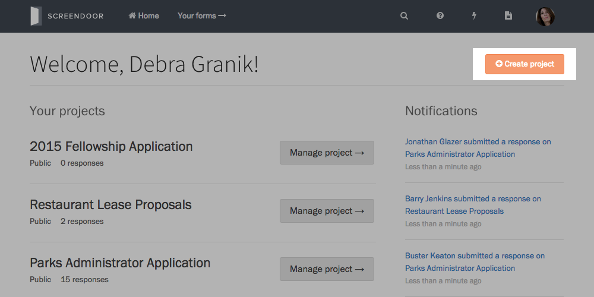

### Creating a project

To start a new Screendoor project, press the "Create project" button on your dashboard.

If it's your first time using Screendoor, you'll see a large "Create your first project" button in the center of the screen. 

### Choosing a template

You can customize Screendoor for any type of form you can think of, but choosing a [project template](templates.html) gives you a head start. Templates come with presets and pre-built forms that are tailored to your type of project. For example, if you're creating a job application, select the "Job" template.

If you don't like the settings a template comes with, you can always change them later. If you don't want any settings decided for you, select the "Blank" template, which has no preset options.

### Example projects

Example projects help you get a sense for how Screendoor projects work, by letting you see one in action. Choose "check out an example project" under the "Choose a template" label to view a list of examples you can create.

Example projects are automatically deleted from your account after 30 days.

