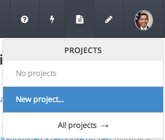
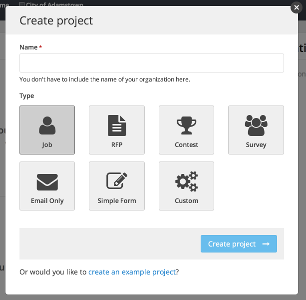

From Screendoor, it's easy to create a new project. Just click the  button or select "New Project" from the Projects dropdown.

## Using a template

If one of our templates corresponds to the type of project you would like to create, select the appropriate template under "Type." Templates provide preset forms and settings, but you can always customize your project after you have created it with a template.

## Custom project (no template)

Select the "Custom" type to create a custom project without a template. Custom projects don't have any pre-configured options, so you can set it up according to your project's specifications.

## Demo projects

If you just want to see a demo project, click the "create an example project" link at the bottom of the "Create project" pop-up. Demo projects are a good way to get a feel for how a project works in Screendoor, and also include sample responses that you can play around with. Note that demo projects will be automatically deleted after 30 days.
