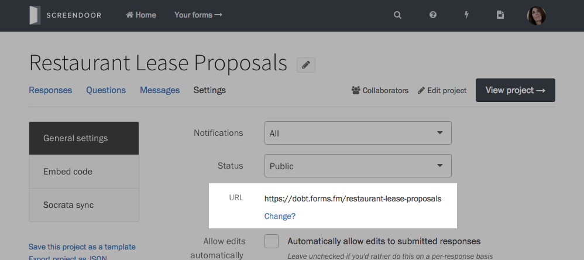

To create a new project, just click the "Create your first project" button from the Screendoor home page or select "New project..." from the Projects dropdown.

## Using a template

If one of our templates corresponds to the type of project you would like to create, select the appropriate template. Templates provide preset forms and settings, but you can always customize your project after you have created it with a template. To learn more about project templates, check out the [Project templates](templates.html) article.

## Blank project (no template)

Select the "Blank" type to create a blank project. Blank projects don't have any pre-configured options, so you can set it up according to your project's specifications.

## Demo projects

If you just want to see a demo project, click the "example project" link under "Choose a template." Demo projects are a good way to get a feel for how a project works in Screendoor, and also include sample responses that you can play around with. Note that demo projects will be deleted automatically after 30 days.

## Changing your project's URL

To change your project's URL, click "Change?" from the "Settings" page. Enter a new URL and click save.

> **Note**: URLs can only contain letters, numbers, and dashes.

