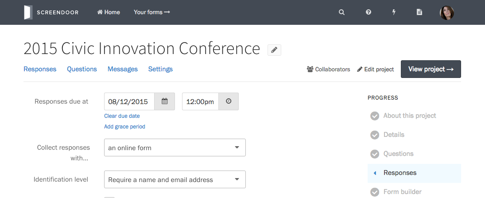

To set a deadline for responses, press the &ldquo;Edit project&rdquo; button on the right side of the project header. In the Progress menu, select &ldquo;Responses&rdquo;.

### Adding a deadline to a project

Under &ldquo;Responses due at&rdquo;, select a date and time to set a deadline for responses.

If you need to extend the due date later, return to this page and set a new date. To clear the due date, click &ldquo;Clear due date&rdquo; below the date and time pickers.

You can also [extend the due date for a specific response](../responses/providing_support_to_respondents.html#extending-the-due-date-for-a-specific-response).

### Setting a grace period

If you want to give some extra time for people who started a response before the deadline to finish it after it has passed, you can add a grace period. Click the &ldquo;Add grace period&rdquo; link below &ldquo;Clear due date&rdquo;, and select a date and time.

---

## F.A.Q.

### What time zone will the deadline be set in?
The deadline for responses will be set in your current local time zone, but the date and time will be automatically be presented to users based on their own local time zone.

For example, if you set the due date to August 15 at 4:00pm and you are on Pacific Time, users on the East Coast will see the due date as August 15 at 7:00pm.
