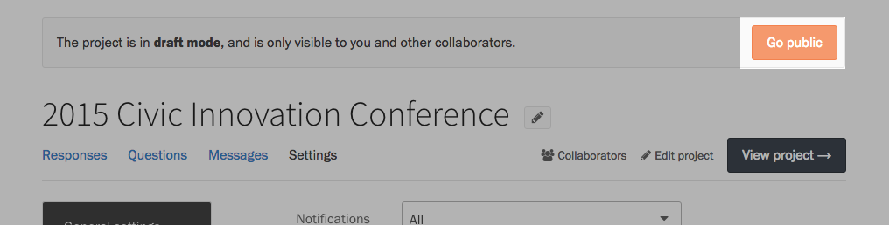
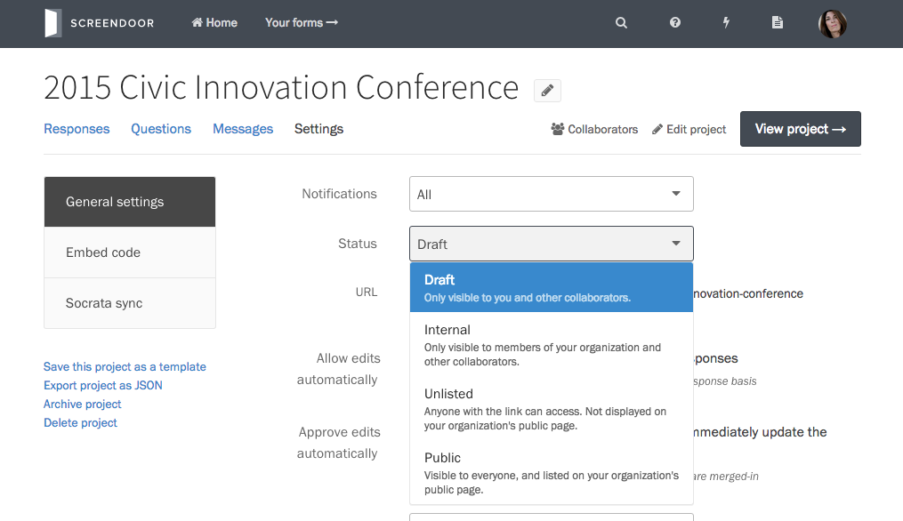

When you're finished setting up your project, it's time to show it to the world. To make your project publicly accessible, press the &ldquo;Go public&rdquo; button in the alert at the top of the page.

Screendoor also lets you publish your project in a semi-private context. You can change your project's visibility on its Settings page under &ldquo;Status&rdquo;.

#### Project statuses

- **Draft:** Only your [collaborators](/articles/screendoor/collaboration/collaborators.html) can see your project. (All projects are drafts by default when they are created.)
- **Internal:** If you want a project to be visible only inside your organization, you can make projects internal.
- **Unlisted:** Anyone with the link will be able to view your project.
- **Public:** Your project will be publicly visible, and linked to from your organization's public page.
