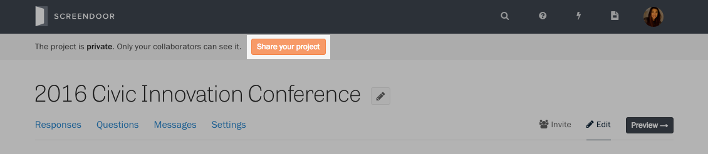
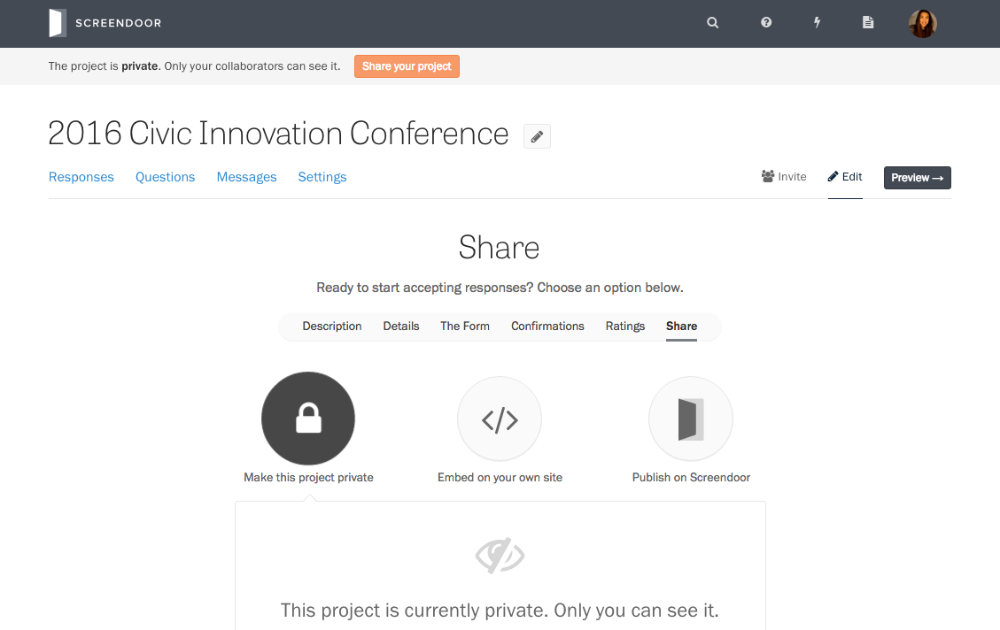
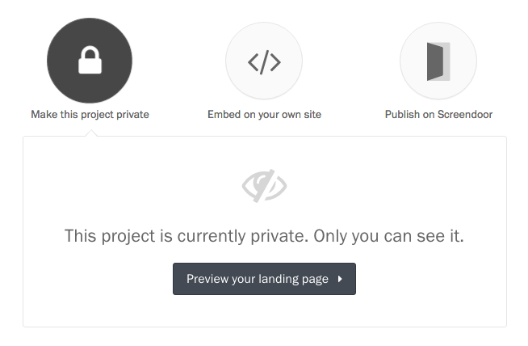
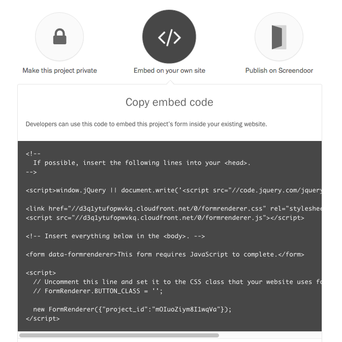
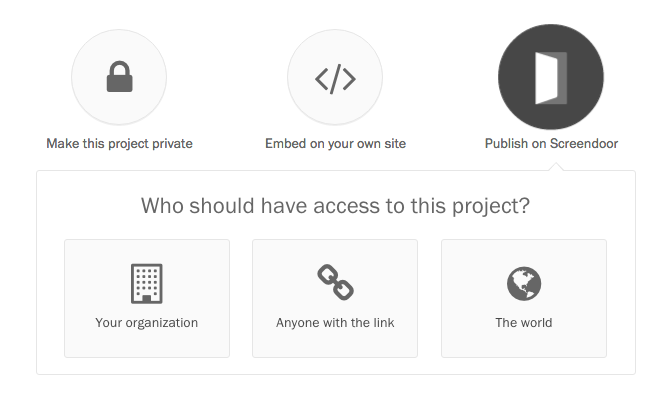
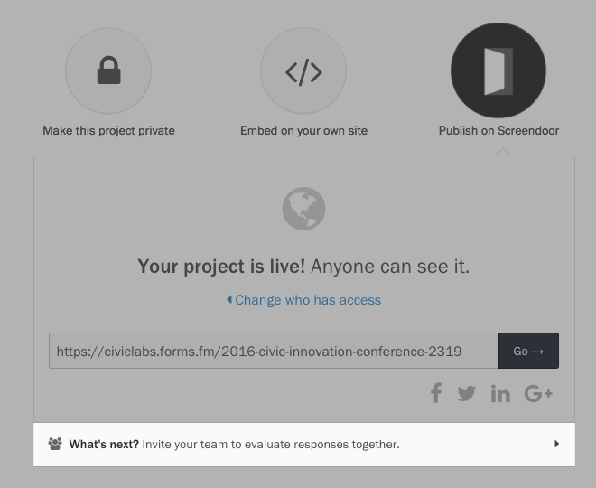

Your project is private by default: only you can see it. When you're ready to start accepting responses, press the "Share your project" button in the alert at the top of the page.

You can also click the "Edit" link in the page header, and select "Share" from the project wizard.

There are a few ways to take your project live:

**Make this project private.** This is the default setting where only you can see your project. Press the "Preview your landing page" to see it on `forms.fm`.

**Embed on your own site.** When you choose this option, your form will not be available to respondents on Screendoor. Instead, you can copy the embed code and paste it into the code for your website.

**Publish on Screendoor.** When you publish your project on `forms.fm`, you can decide whom to share it&nbsp;with.

- _Your organization._ All the users within your Screendoor organization can see your form. (They won't, however, have permission to view and rate responses [unless you explicitly invite them](/articles/screendoor/collaboration/collaborators.html).)
- _Anyone with the link._ Only people with the link can see your form.
- _The world._ Anyone can access your form. It will also be accessible from your organization's `forms.fm` landing page.

Once you've shared your project, whether on Screendoor or your own site, you can [invite your team to review responses with&nbsp;you](/articles/screendoor/collaboration/collaborators.html). To do so, press the "What's next?" banner at the bottom of the page.

