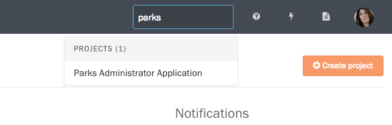

Screendoor displays your organization's most recently updated projects on the dashboard when you log in. To see all of your projects, select the "All your projects" link on the dashboard.

You can also access this page at any time from the navigation bar. Choose the Projects icon in the righthand corner, and select "All projects".

The easiest way to search for a specific project is to press the Search icon in the navigation bar and start typing that project's name.

If the sitewide search returns too many results, you can narrow your search to only projects. Select the "All your projects" link from the dashboard, and use the search bar in the upper right corner of the page.

