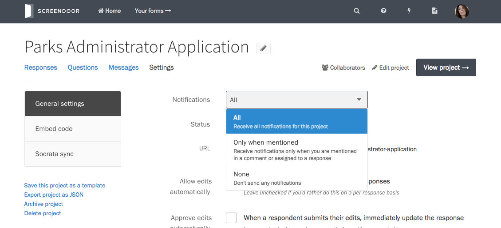
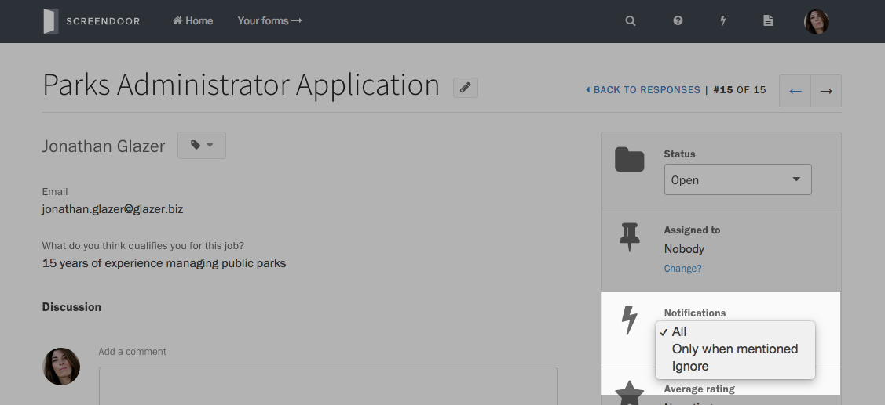
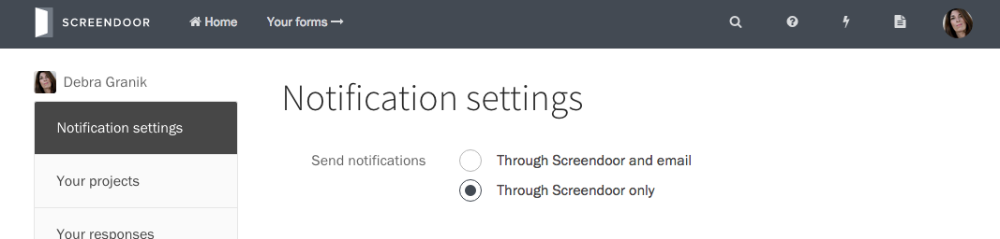

### Project-wide notifications

By default, creators of a project get notified for everything that happens on that project. If you are a collaborator on a project, you will only be notified if you are mentioned in a comment or assigned to a response.

You can change your notification settings for any project on its Settings page, under &ldquo;General settings&rdquo;.

### Ignoring a response

If you're receiving all notifications for a project, the activity on a Screendoor project can quickly get overwhelming. Sometimes, you want to stop getting notified for responses with a lot of activity, while still receiving emails for the rest of the project. 

To ignore a response, go to the project's Responses page, and click on a response. You can change your notification preferences in the dropdown on the right-hand side. Ignoring a response will block all notifications for that response, even if someone assigns you or mentions you in a comment.

### Turning off email notifications

To disable all email notifications from Screendoor, click on your avatar in the upper right-hand corner of the window, and select &ldquo;Settings&rdquo;. 

Under &ldquo;Send notifications&rdquo;, select &ldquo;Through Screendoor only&rdquo;.

