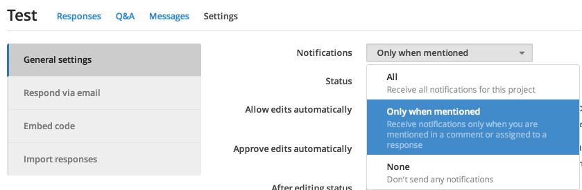
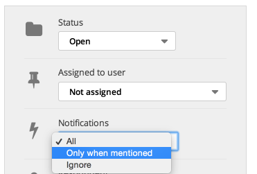

## Configuring project notifications

When you create a project, you'll receive all notifications for that project by default. If you're added to a project, you'll only receive notifications if you're mentioned in a comment or assigned to a response, by default. To change your notification setting for a project, select an option from the "Settings" page.

## Configuring response notifications

If you're receiving all notifications for a project, you'll also receive all notifications for new responses by default. Otherwise, you'll only receive notifications when you're mentioned in a comment or assigned to a response.

To change your notification setting for a response, simply select the appropriate option from the "Notifications" dropdown on the response page.

> **Note**: If you select "Ignore" for a response, you will not receive any notifications for that response, even if someone assigns you to it or mentions you in a comment.

