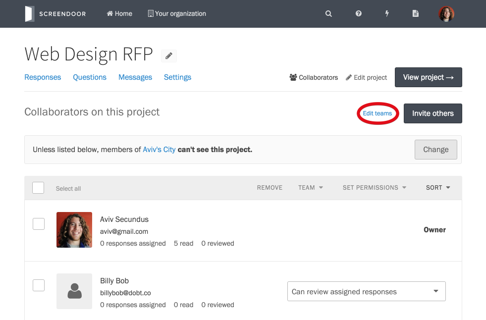
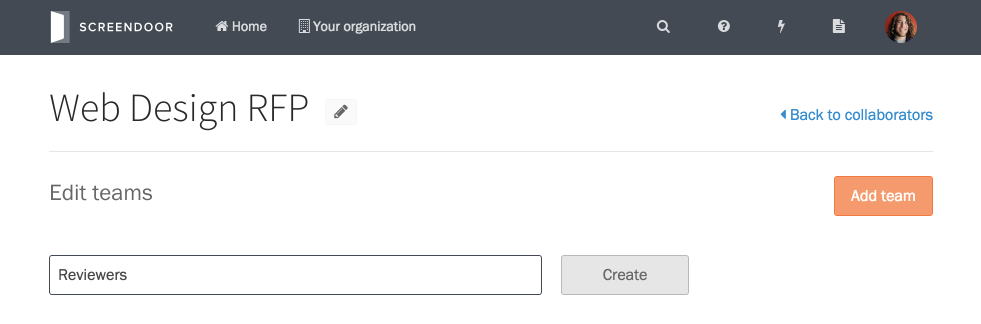
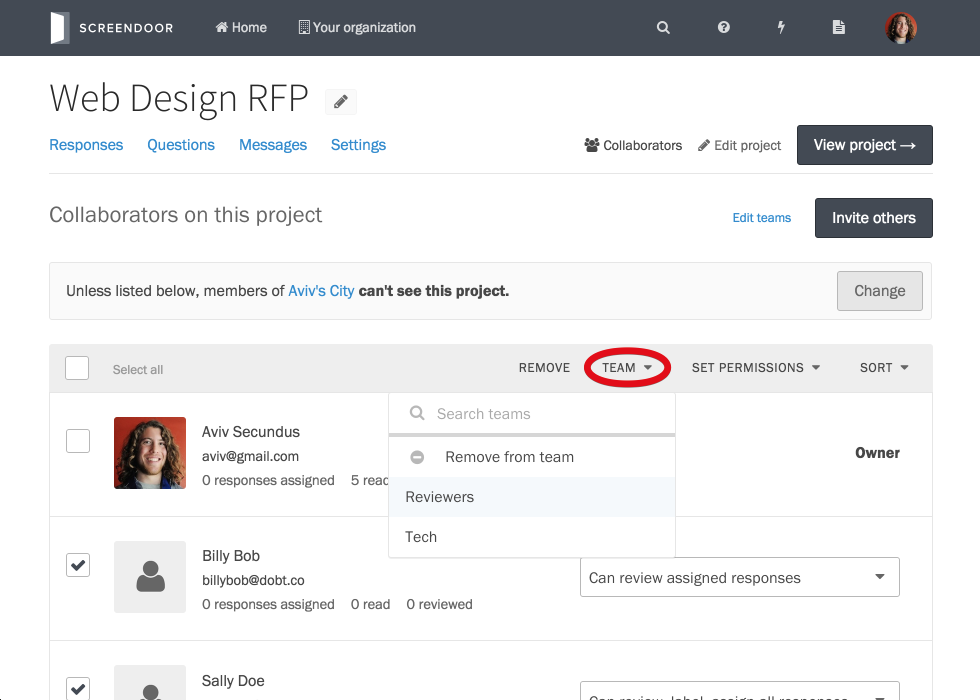
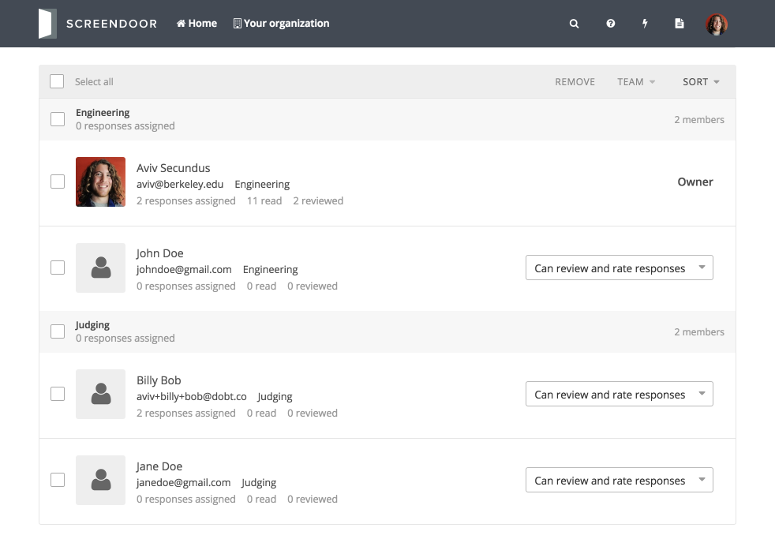

Organize collaborators into teams to streamline the collaborative review workflow for your project.

## Managing teams

To manage teams for your project, click the "Edit teams" link from the "Collaborators" page.

### Adding teams

To add a team, click the "Add team" button from the "Edit teams" page. Enter the name of your team and click "Create."

### Renaming and deleting teams

To rename a team, click the "Rename" link for a team. To delete a team, click the "Delete" link.

## Assigning collaborators to a team

To assign collaborators to a team, check the box next to the appropriate collaborators from the "Collaborators" page for your project. Then, click the "Team" button and select the appropriate team from the dropdown.

That's it! Once you've configured your project's teams, you can [assign responses](../responses/sorting_and_filtering_responses.html#assigning-responses) to the appropriate team for review.

