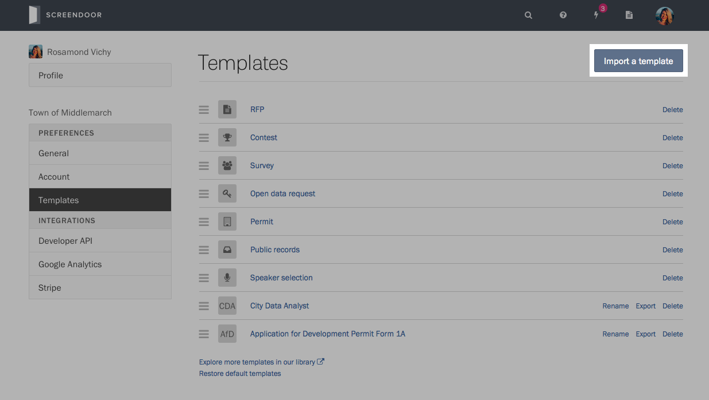

If you create the same type of Screendoor project frequently, you can save a project's form and settings as a template to reuse later. You'll have the option to use that template each time you create a project.

    **Note**: To create or manage templates, you must be a site administrator or a user with the appropriate permissions.

### Creating a template

To save an existing project as a template, visit the project's Settings page and select "Save this project as a template."

### Managing templates

To view your existing templates, press the "Create Project" button on the dashboard and select "Edit templates."

Alternatively, click your avatar in the navigation bar, select "Your organization" from the dropdown. Then, select "Templates" in the sidebar.

From this page, you can rename and delete the templates you have created. You can also export your templates if you want to share them with other Screendoor customers.

All Screendoor accounts come with a few pre-installed templates for job applications, RFPs and more. If you don't need these templates, you can delete them from this page.

### Previewing a template

If you want to see what a template looks like before using it, click on its name on the "Templates" page.

Use the tabs at the top of the Preview page to view the template's project description, questions, form, and other settings. If you decide to use it, press "Create a project with this template."

### Updating a template

If you want to edit a template, simply create a new project with it, make some changes, and save it as a new template. You can always go back and delete the original template if you don't need it anymore.

### Importing templates

Screendoor lets you import templates that other customers have exported. To import a template, visit the "Templates" page, select "Import a template," and choose the template you want to import.

You can also preview and import a variety of project templates from [our template library](https://github.com/dobtco/screendoor-project-templates).

---

## F.A.Q.

### I accidentally deleted one of the pre-installed templates. Can I recover it?
Yes! Simply click "Restore default templates" at the bottom of the "Templates" page.
