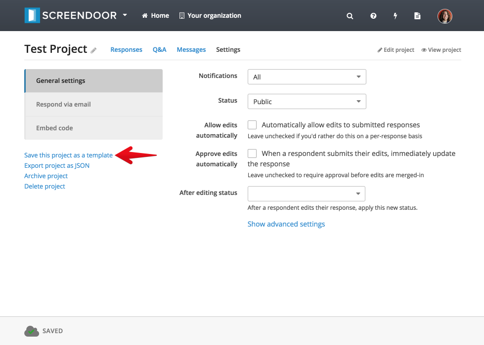
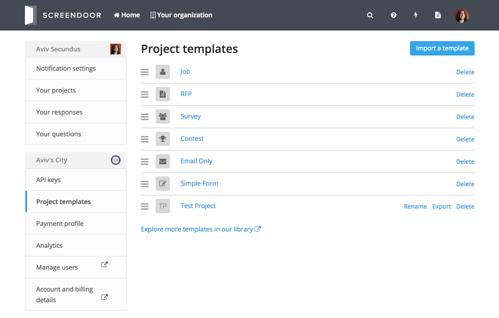
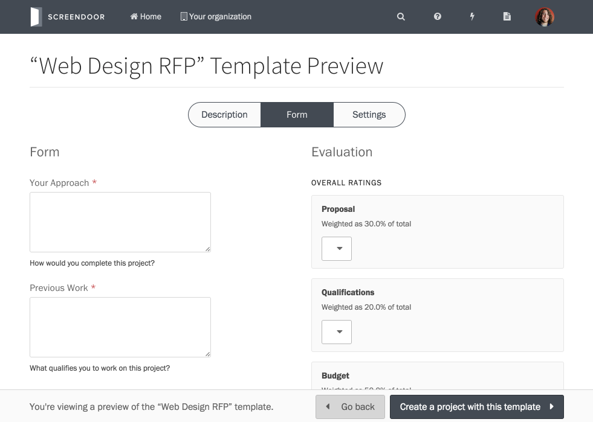
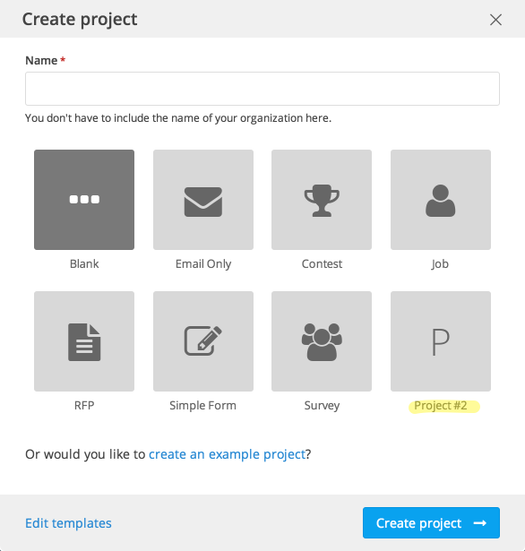

Project templates allow you to re-use configuration settings from existing projects when you create new projects.

> **Note**: You must have the appropriate [permissions](/articles/dashboard/accounts/managing_users.html#managing-user-permissions) in order to manage project templates for your organization.

## Creating templates

To save an existing project as a template, click "Save this project as a template" from the "Settings" page for your project.

You will then be re-directed to the "Project templates" page.

## Managing templates

From the "Project templates" page, you can view and manage your project templates.

## Previewing templates

To preview a template, just click on its name from the "Project templates" page.

From the preview page, you can click the "Create a project with this template" button to use that template for a new project.

## Using templates

To use a template for a new project, simply select it from the list of templates when you create a project.

## Updating a template

If you want to make changes to a template, simply create a new project with it. Then, make the necessary changes and re-save your new project as a template. You can always go back and delete the original template if you don't need it anymore.

## Importing templates

To import a template, click "Import a template" and select the appropriate file.

You can also preview and import a variety of project templates from [our template library](https://github.com/dobtco/screendoor-project-templates).

## Exporting templates

To export a template, simply click the "Export" link next to a template.

> **Note**: You can share these exported YAML files with other Screendoor users.

---
## If I accidentally delete a default template, can I recover it?
Yes! Simply click the "Restore default templates?" link from the "Project templates" page.
