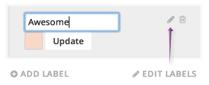
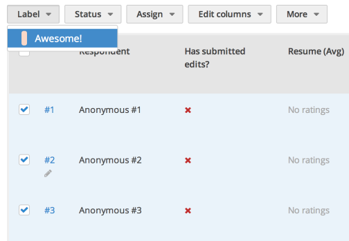
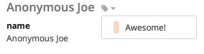

Labels are another helpful way to organize responses, and are similar in function to "tags." Responses can have multiple labels, and labels can be applied to any number of responses.

## Creating labels

To create a label, click "Add label" on the left-hand side of the "Responses" page. Enter a name for your label (and optionally select a color), then click "Create."

## Managing labels

You can always go back and edit your labels after you create them. Simply click "Edit labels" and then click the pencil icon to update your label's name or color.

## Labelling multiple responses

To label responses from the "Responses" page, check the box next to the responses you'd like to label, click the "Label" dropdown, and select the appropriate label.

## Labelling individual responses

To label responses from an individual response's page, click the label icon and select the appropriate label.

## Filtering responses by label

To filter responses by label, click the appropriate label on the left-hand side of the "Responses" table. To stop filtering by that label, click it again.

