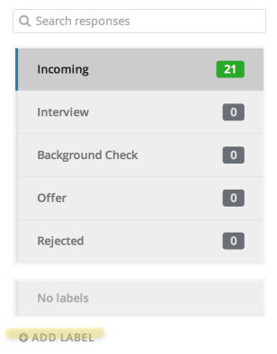
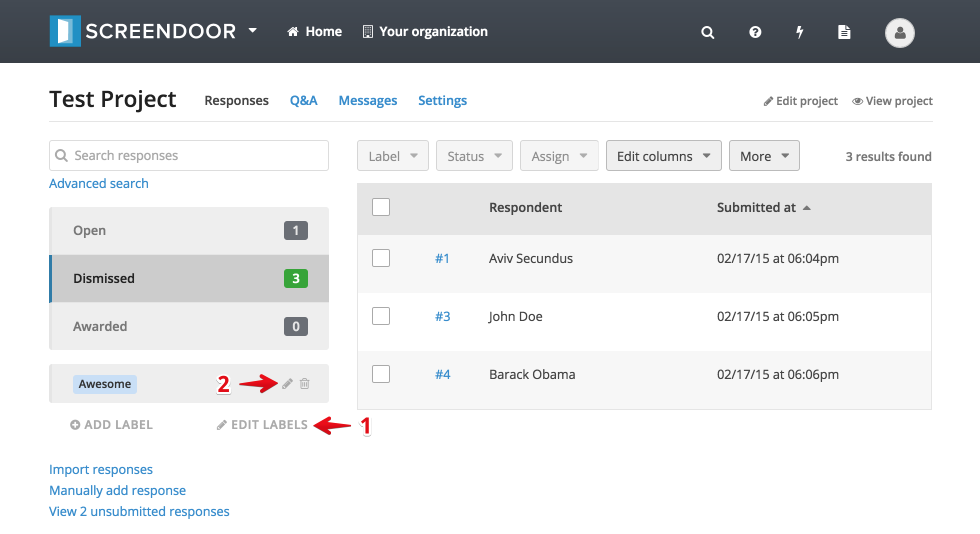
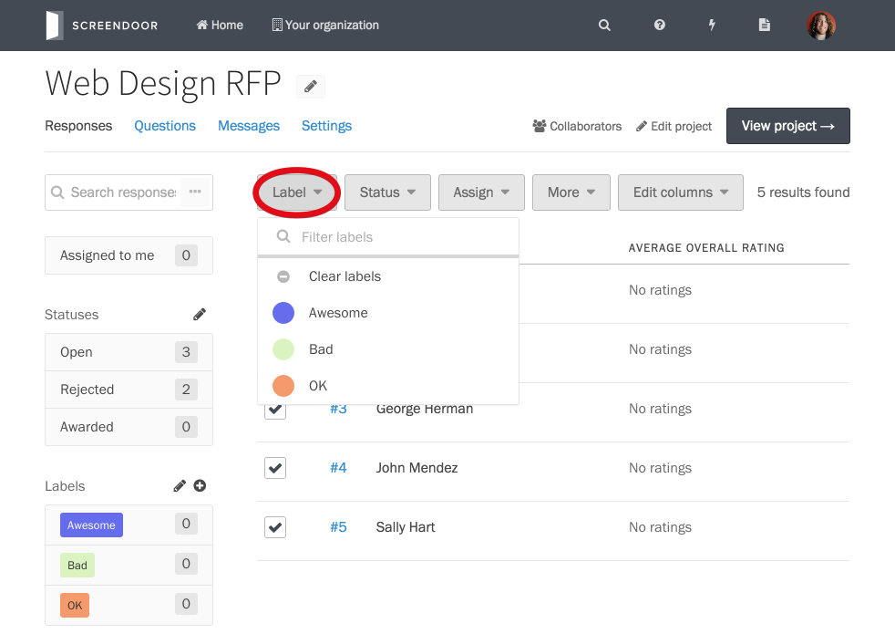
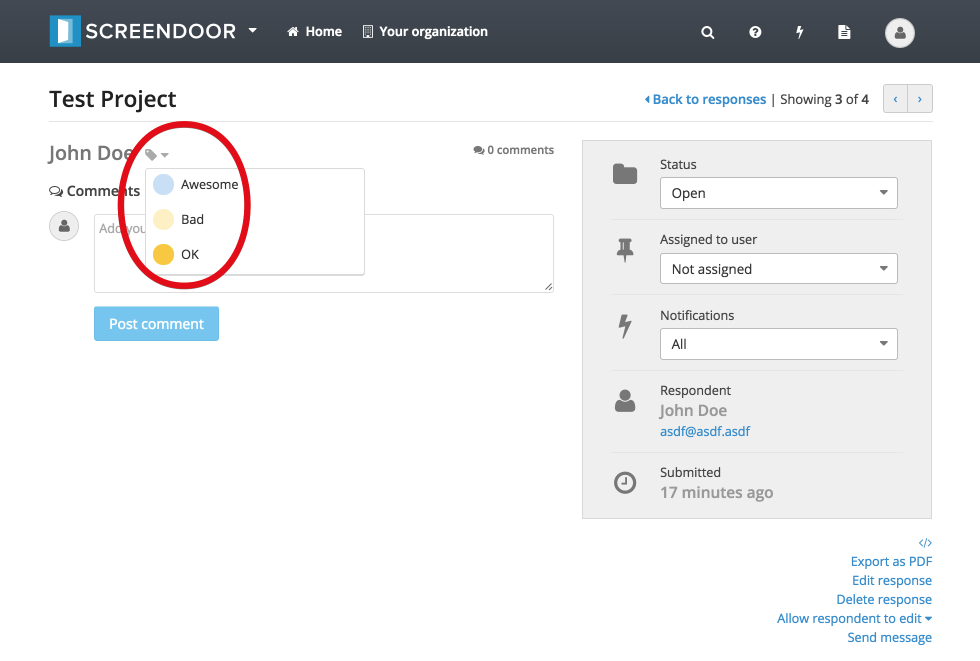
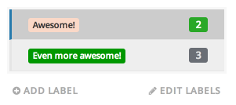

Labels (also known as "tags") are another helpful way to organize responses. Responses can have multiple labels, and labels can be applied to any number of responses.

## Creating labels

To create a label, click the "Add label" icon on the left-hand side of the "Responses" page. Enter a name for your label (and optionally select a color) and click "Create."

## Managing labels

You can always go back and edit your labels after you create them: Click the "Edit labels" icon and then click the same icon next to the label you'd like to edit.

## Labelling multiple responses

To label responses from the "Responses" page, check the box next to the responses you'd like to label, click the "Label" dropdown, and select the appropriate label.

## Labelling individual responses

To label responses from an individual response page, click the label icon and select the appropriate label from the dropdown.

## Filtering responses by label

To filter responses by label, click the appropriate label on the left-hand side of the "Responses" table. To stop filtering by that label, click it again.

