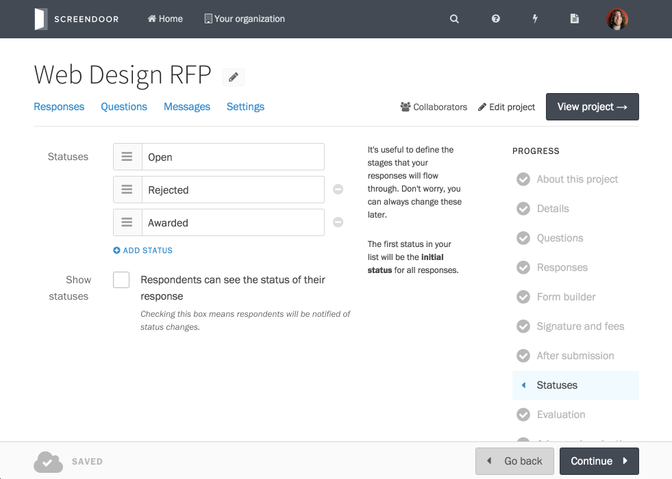
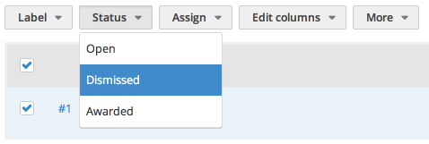
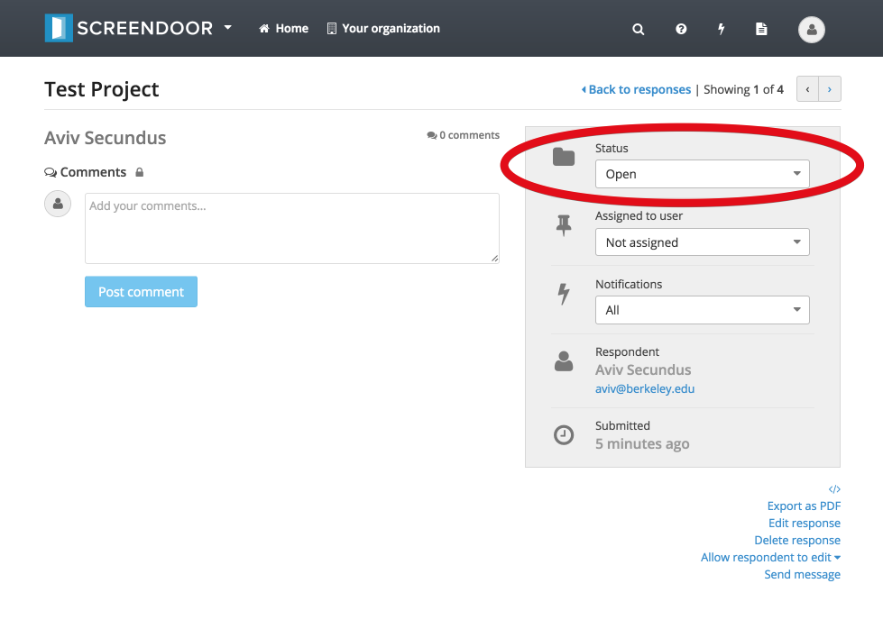
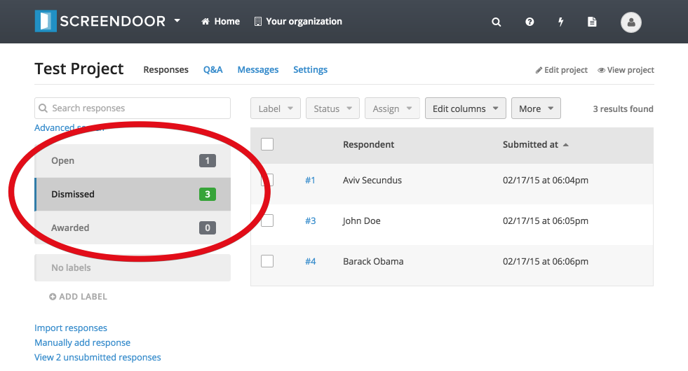

Statuses are a helpful way to organize responses and keep track of their current state. You can configure your project-specific statuses according to the needs of your project. For example, the "Apps Contest" demo project uses three statuses ("Open," "Lost," or "Won") to designate the current state of each contest entry.

## Managing statuses

You can define statuses for your project when you first create it, but you can also configure and manage statuses at any time by clicking "Edit Project" and selecting "Statuses" from the Project Checklist on the right-hand side of the page. It should look something like this (though the names and colors of the statuses in your project will probably be different):

You can apply any name or color to a status. Simply click on either the name or the color to change it. You can also re-arrange the order of your statuses by dragging and dropping them. Keep in mind that the first status will be the default status assigned to new responses. To add a new status, click the "Add status" button.

## Assigning responses to statuses

You can set the status of responses from the "Responses" table by checking the box next to a response (or multiple responses), clicking the "Status" dropdown above the table, and selecting the appropriate status.

You can also assign a response from an individual response page by clicking on the "Status" dropdown in the sidebar on the right-hand side of the page.

## Filtering responses by status

To filter responses by status, just click on a status on the left-hand side of the responses table.

---

## What happens when I delete a status?
When a status is deleted, any responses that were assigned to that status are re-assigned to the first status in the list.

## Why can't I delete my status?
You must always have at least one status that serves as a default status.

## What's the difference between statuses and labels?
Responses always have exactly one status, but can have multiple labels. For example, a response's *status* could be either "Open" or "Closed," but it could be *labeled* as both "Interesting" and "Practical."
