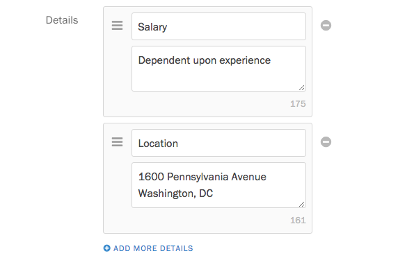

Screendoor's project pages tell your audience why they should fill out your form, and give them the information they need to start.

### Making a first impression with project summaries

When someone tries to find your Screendoor project in a Web search, or someone links to it on social media, they will see your project's summary alongside its name and your logo.

After creating a project, you can add a summary to your project, right below the Description field. Try to describe your project in a sentence. Try to make it compelling to your audience, so that they're compelled to click through and view your project.

You can always edit your summary later. Just click the &ldquo;Edit project&rdquo; link on the right side of the project header.

### Adding a description

Every Screendoor project comes with a gorgeous Forms.fm landing page, [with your own logo and color scheme](/articles/screendoor/projects/branding_your_forms.html). When someone visits your project, the description is the first thing they'll see. 

You can add a project description right after creating a project on the &ldquo;About this project&rdquo; page.

The description is a chance for you to go into detail about your project, convince your audience to complete your form, and prepare them for anything they'll need going forward. Why should they take the time to respond? Is there any documentation they need, or information they need to know, before they start?

### Uploading attachments

If your respondents need additional documentation to complete your form, beyond a text description, you can upload files as attachments to your form. At the bottom of the &ldquo;About this project&rdquo; page, upload a file within the &ldquo;Attachments&rdquo; section. To upload more than one attachment, click the &ldquo;Add an attachment&rdquo; link.

### Highlighting important information

On large screens (like desktops and laptops), your project page is displayed in two columns: your description, and a sidebar on the right. If you want to call out concise, relevant information near the top of your project page, you can add information to the sidebar. For example, if you're creating a job application, you may want to add salary information and the location of your office.

To get started, click the &ldquo;Details&rdquo; link in the righthand menu, and scroll down to the &ldquo;Details&rdquo; section.

From this page, you can add, reorder and remove items from the sidebar. Details are a good place to add information like salary
