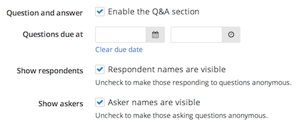

Enabling the question and answer section for a project allows respondents to ask questions. You (or someone else on your team) can then answer these questions and optionally display them publicly.

## Configuring the question and answer section

When you initially set up your project, you can configure the question and answer section under the "Question & Answer" step on the "Project checklist." However, you can also go back later and configure the question and answer section by clicking "Edit project" and selecting "Question & Answer" from the project checklist. To enable the question and answer section, make sure the checkbox next to "Enable the Q&A section" is checked. Then, you can select a due date (or leave it open-ended) and configure whether or not the respondent's and/or asker's names are visible.

See [Managing questions](managing_questions.html) for information on how to manage and respond to questions.