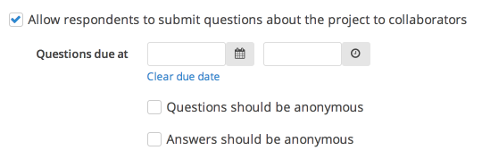

To enable and configure the question and answer section for your project, click "Edit project" and select "Questions" from the "Progress" menu. Make sure the checkbox next to "Allow respondents to submit questions about the project to collaborators" is checked.

If you'd like to set a due date for submitting questions, you can do so by selecting a date from the date/time picker. If you'd like questions (and/or answers) to remain anonymous, check the appropriate box.

See [Managing questions](managing_questions.html) for information on how to manage and respond to questions.
