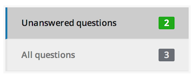

If you haven't configured the question and answer section for your project yet, check out the [Configuring the question and answer section](configuring_the_question_and_answer_section.html) article.

## Managing questions

To manage questions (and answers) for your project, click the "Q&A" link from your project page.

You can display all questions or only unanswered questions by clicking either box on the left-hand side of the "Q&A" page.

You can destroy a question by selecting it from the table of questions on the "Q&A" page and then clicking the "Destroy question" link at the bottom of the question page.

## Answering questions

To answer a question, select the question from the table of questions on the "Q&A" page. Enter your answer, select whether or not you'd like this question/answer to be displayed publicly, and then click the "Post answer" button. You can always go back and change your answers simply by selecting the appropriate question and editing the answer text on the question page. You can also remove an answer by clicking the "Remove answer" button on the question page.

---

## Can I answer a question privately?
Yes, just uncheck the "Display this question publicly" checkbox when you answer the question.

## Can I add a question manually?
Yes, just initialize the question yourself by clicking the "Submit question" link from the main project page. Then, you can answer it normally.

