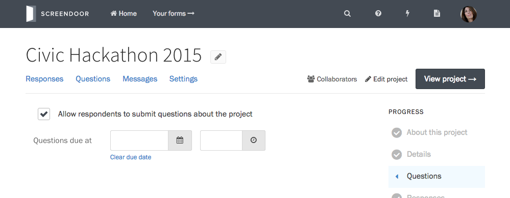

Setting up a public question-and-answer page for your project makes communication more efficient for everyone involved. It's a great way to reduce support email by allowing respondents to see the questions other people have asked. Hosting a questions section on Screendoor also helps keep your team coordinated: all project admins have access to a shared inbox of questions at the same time, so they never need to give two different answers to similar questions.

To set up questions for your project, press &ldquo;Edit&rdquo; in the header, and select &ldquo;Details&rdquo; on the right-hand side. Under &ldquo;Questions&rdquo; check the box &ldquo;Add a questions page.&rdquo;

When you enable questions for a project, Screendoor gives you an option to set a deadline for questions to be submitted. For some forms, it might be crucial to set a deadline for questions that occurs before submissions close (when creating an RFP, for example). If this doesn't apply to you, you don't need to worry about this setting.
