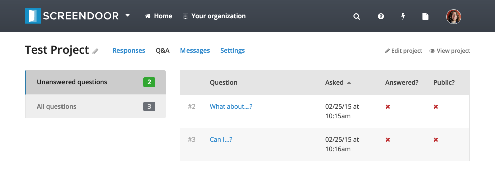
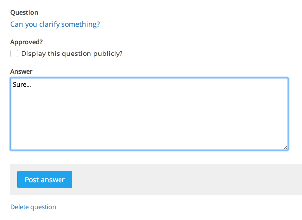
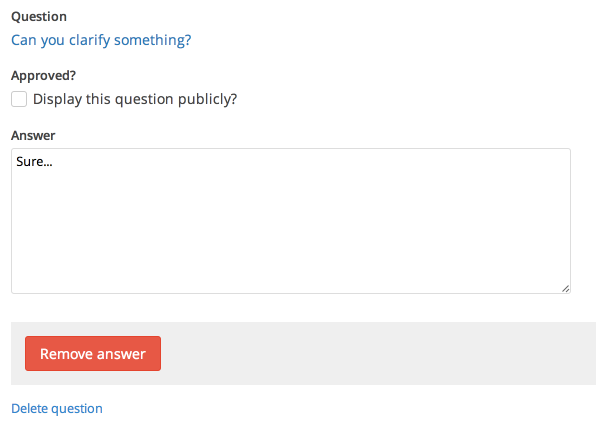

Read more about [how to set up questions for a project](configuring_the_question_and_answer_section.html).

## Managing questions

To manage questions (and answers) for your project, click the "Questions" link from your project page. You can display all questions or only unanswered questions by selecting the appropriate box from the left-hand side of the "Questions" page.

To delete a question, select it from the table of questions on the "Questions" page and then click the "Delete question" link at the bottom of the page.

## Answering questions

To answer a question, select it from the table on the "Questions" page. Enter your answer, select whether or not you'd like it to be displayed publicly, and then click the "Post answer" button.

You can always go back and change your answer by selecting the appropriate question and editing the answer text from the question page. You can also remove an answer by clicking the "Remove answer" button.

---

## F.A.Q.

### Can I answer a question privately?
Yes, just uncheck the "Display this question publicly?" box when you answer the question.

### Can I add a question manually?
Yes, just initialize the question yourself by clicking the "Submit question" link from the main project page (get there by clicking the "View project" button). Then, you can answer it normally.

