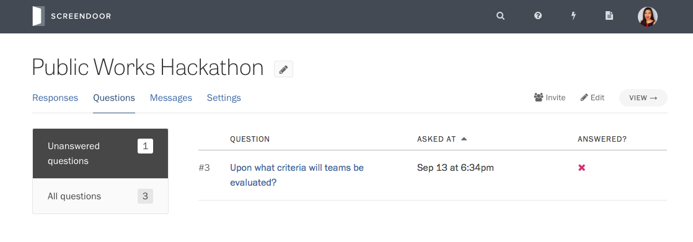
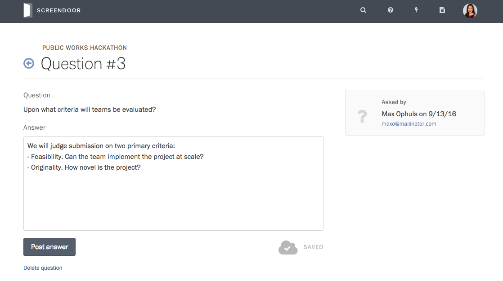
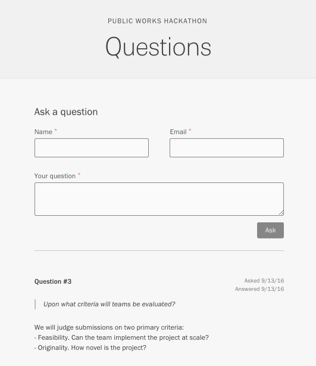

Read more about [how to set up questions for a project](configuring_the_question_and_answer_section.html).

### Viewing questions

On your project's Questions page, you can see all of the questions asked by the public, as well as whether they have been answered or made visible for others to see.

By default, Screendoor only shows you questions that have not yet been answered. Select "All questions" in the sidebar to view those that have already received answers.

### Answering and editing questions

To answer, edit, or delete a question, select it from the table on the Questions page.

After you answer a question, you can always return to this page to edit your answer or remove your answer entirely.

---

## F.A.Q.

### Can I answer a question privately?
Yes. Just uncheck the "Display this question publicly" box when you answer the question.

### Can I add a question to my own project?
Yes. First, press the "View" button to visit your project's landing page. Then, click the "Ask a question" link in the page header.

