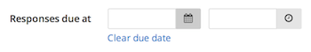
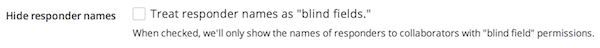
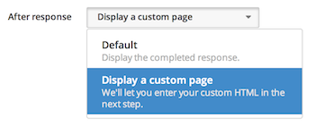

To configure preferences for responses, click "Edit project" and select "Responses" from the project checklist.

## Adding a response due date

Set a deadline for responses by selecting a date from the date/time picker.

If you need to extend the due date, simply return to this page and select a new date. You can also clear the due date and allow all responses by clicking "Clear due date."

## Requiring Screendoor registration

By default, Screendoor requires respondents to be registered as Screendoor users. However, it's easy to waive this requirement by unchecking the "Require registration" box.

## Hiding respondent names

To hide respondent names from reviewers, check the "Treat respondent names as 'blind fields'" box.

## Displaying a custom "after response" page

To display a custom page to respondents after they submit their response, select "Display a custom page" from the "After response" dropdown.

You can then write and preview your custom page under "After Response Page" in the project checklist.