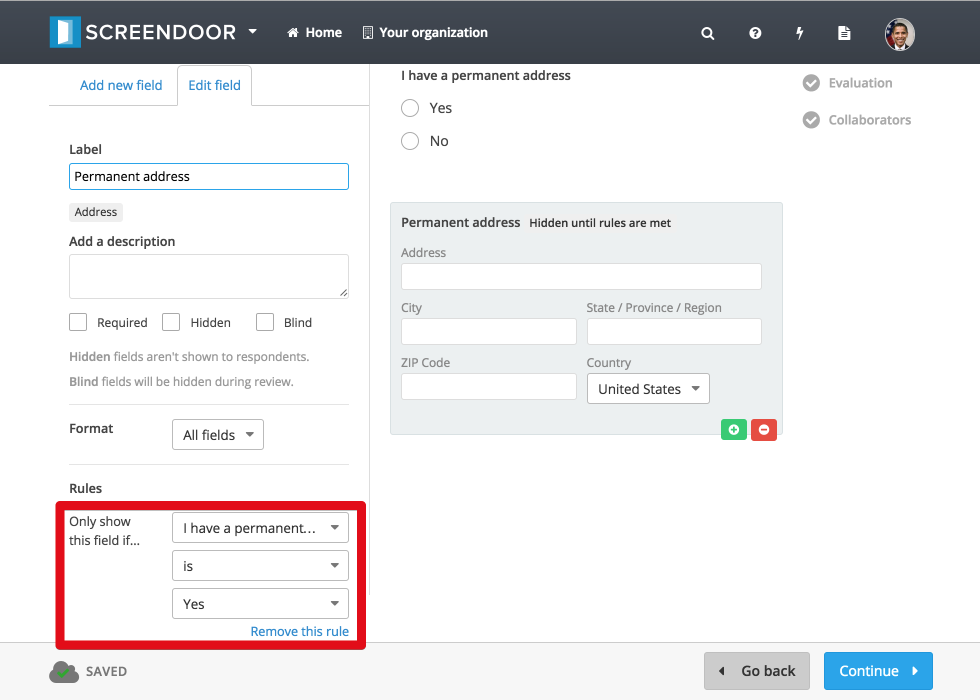

## Building your form

At the heart of your project is your response form. You'll build your form when you first create your project, but you can also always go back and edit your form by clicking "Edit project" and selecting "Form builder" from the progress menu.

### Adding new fields

To add a new field to your form, click the "Add new field" button on the left-hand side of the form builder. Then, click the appropriate field type (for example, "Address" if you would like to collect address information from your respondents) to add it to your form. Once form fields have been added, you can always drag-and-drop to change their order within the form.

### Editing fields

To edit a field, first select it from the list of response fields. Notice that the selected field's background is darker, and that the edit options for that field appear on the left-hand side of the page. When you edit a field's name, description, or configuration options, the results of your edits are reflected immediately.

### Copying fields

To copy an existing field, click the green "+" icon that appears when you move your mouse over the field.

### Deleting fields

To delete an existing field, click the red "-" icon that appears when you move your mouse over the field.

If there are already responses to your project, you'll see a dropdown prompting you to either "Hide this field" or "Delete this field and its answers." Select "Delete this field and its answers" from the dropdown and then click "Confirm" to delete this field and all of its answers. You may also decide to hide this field instead of deleting it by selecting "Hide this field" from the dropdown. If you hide a field, existing answers will be preserved but respondents won't see the field anymore.

## Adding rules

Use rules to only show certain fields when the respondent needs to fill them in. Rules allow you to create powerful forms where fields are hidden or shown based on a respondent's previous answers.

> **Note**: Try to keep your forms simple: If you find yourself creating complex conditional scenarios or making forms with dozens of pages, consider breaking your complicated form up into several simpler forms.

To show a field only when specific criteria are met, select your field and click "Add a rule" from the "Edit field" tab in the form builder.

Select the appropriate options from the dropdowns under "Only show this field if..."

You'll see "Hidden until rules are met" next to your form field.

> **Note**: If you want to show multiple fields based on a previous answer, you'll need to add the appropriate rule for each field.

## Hidden fields

To hide a field, select it and click the "Edit field" tab. Then, check the box next to "Hidden." Hidden fields will not be shown to respondents, but they can be seen and edited by admins.

## Blind fields

To make a field blind, select it and click the "Edit field" tab. Then, check the box next to "Blind." Blind fields will not be shown to evaluators during the review process.
