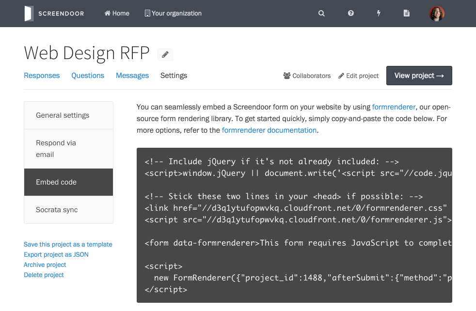

## Embedding the response form

Screendoor allows you to embed the response form for your project in your own website, making it even easier for respondents to fill out your form. To embed the response form, click "Settings" from your project page and select "Embed code" from the navigation boxes on the left-hand side of the page. Then, copy the HTML code onto your own website.

 Here is an example of a simple embedded response form for a live Screendoor project (from the "Apps Contest" example):

<form data-formrenderer></form>

## Customizing the embedded form

Screendoor's embed code is highly customizable. Take a look at the open-source repository for all of the available options: [https://github.com/dobtco/formrenderer-base](https://github.com/dobtco/formrenderer-base).

---

## Why does my embed code not work?
If you are seeing the "project not found" error when you try to embed your code, it's probably because your project is not live. To make your project live, click the "Go live" button from your project page. Also, projects with [payments](payments.html) or [signatures](signatures.html) enabled cannot be embedded.
