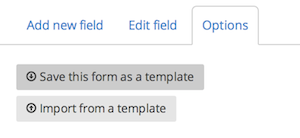
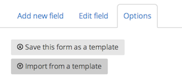

Form templates enable you to save your forms as templates and re-use them in new projects.

## Creating a form template

To create a form template from an existing form, select the "Options" tab from the form builder and click the "Save this form as a template" button.

To create a form template from scratch, click "Organization settings" from the "User" menu and select "Form templates" at the bottom of the navigation bar on the left-hand side.

From the "Form templates" page, you can create a form template by clicking the "New form template" button and filling out the form with the appropriate fields. You can also search for form templates that you have created, as well as edit and delete form templates.

## Using a form template

Once you have created a form template, it's easy to use it in your forms. From the "Response form" step in your "Project checklist," select the "Options" tab and click the "Import from a template" button. Note that importing a form from a template will replace your current form fields with the template's fields. This makes templates most suitable for importing into empty projects.

