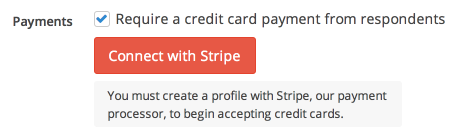
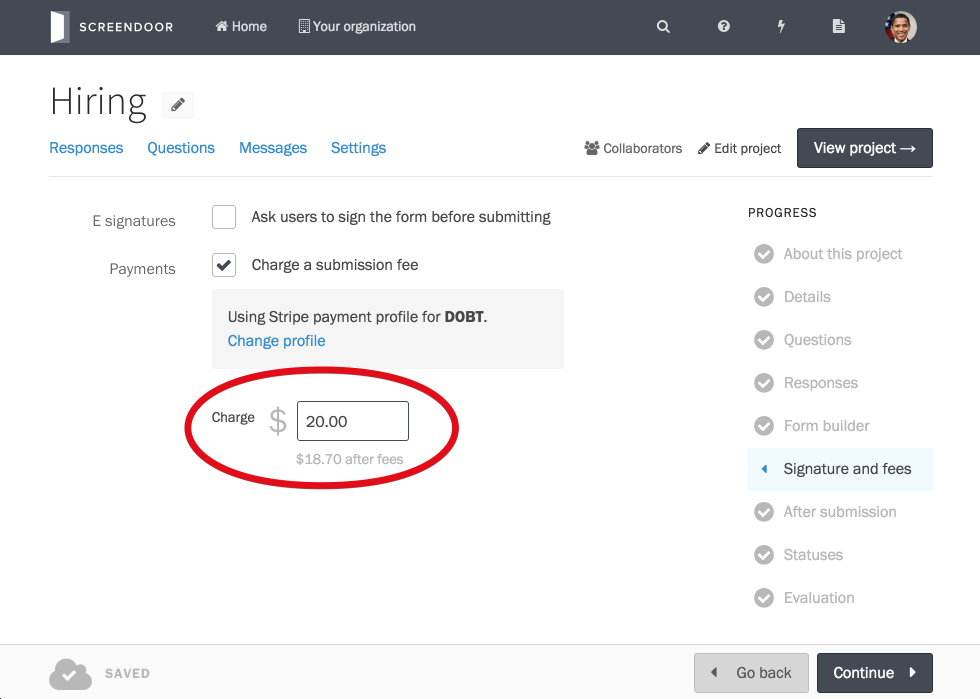
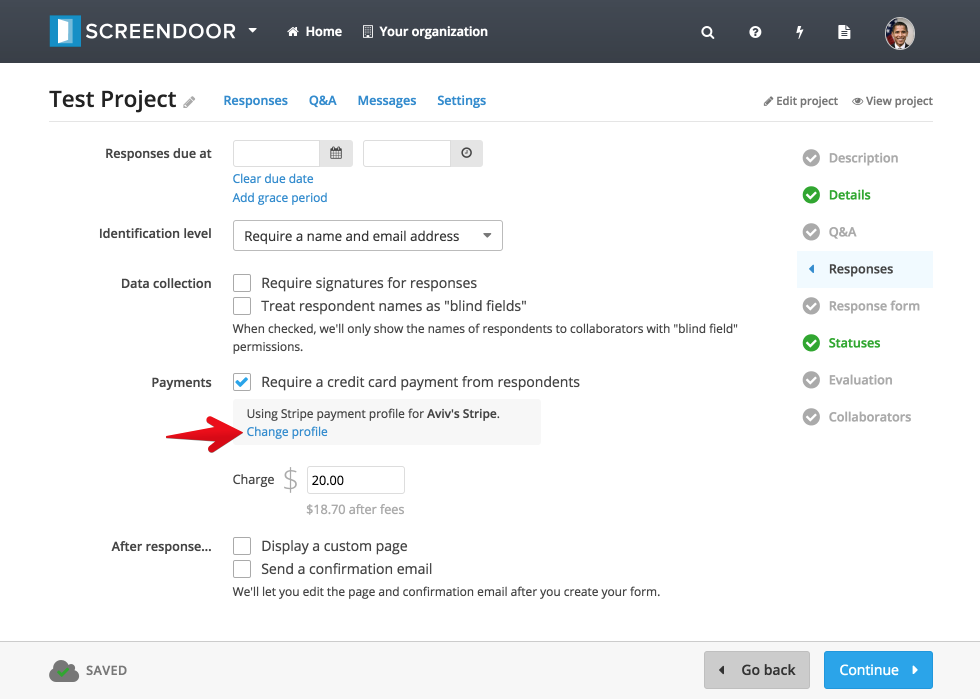
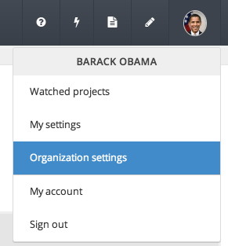
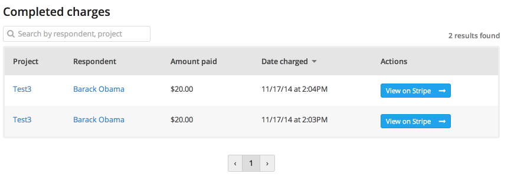
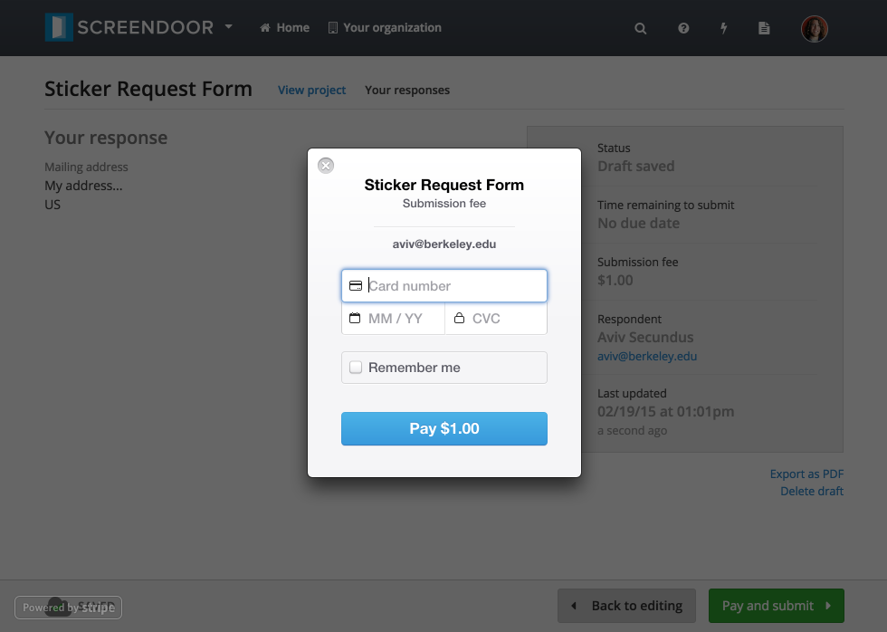

## Enabling payments

Screendoor lets you easily receive credit card payments from your respondents via [Stripe](https://stripe.com/). After enabling payments and setting a charge amount, your respondents will be charged when submitting their response. Note that you will need to create a Stripe account in order to accept payments via Screendoor.

To enable payments, click "Edit project" and select "Responses" from the Project Checklist. Check the "Require a credit card payment from respondents" box.

> **Note**: Screendoor will only require a payment from respondents if you have a valid payment profile set up and define a charge amount.

Click the "Connect with Stripe" button to connect to your Stripe account. You'll be redirected to the "Stripe: Connect with Screendoor" page, where you'll see the message "Screendoor would like you to start accepting payments with Stripe." Fill out the form and click the "Authorize access to this account" button to go back to Screendoor.

> **Note**: Payment profiles are shared across all the projects in your organization: if you have multiple projects, you won't have to set up a payment profile for each one separately. 

Next, enter the charge amount for your project.

That's it! Respondents will now be required to pay before submitting their response.

## Switching payment profiles

To disconnect your current payment profile, click the "Change profile" link from the "Responses" step in your Project Checklist.

Then, click the "Connect with Stripe" button to connect to a different Stripe account.

## Viewing completed charges

To view completed charges, click "Organization settings" from the "User" menu and select "Payment profile" from the navigation box on the left-hand side of the page. You can also manage the payment profile for your organization from this page.

From the "Payment profile" page, you'll see a list of completed charges for your organization.

Click the "View on Stripe" button for a charge to view it in your Stripe dashboard.

---

## Will respondents need a Stripe account in order to pay?
Nope, all they'll need is a valid credit card. This is what the payment form will look like to respondents:

## Can I waive payment for specific respondents?
Yes, you can waive payment for a specific response from the [unsubmitted responses](../responses/viewing_unsubmitted_responses.html#waiving-payment-for-a-specific-response) page.

## Are there processing fees?
Yes. Stripe [charges](https://stripe.com/us/pricing) 2.9% + 30&cent; and Screendoor charges 2.1%.

