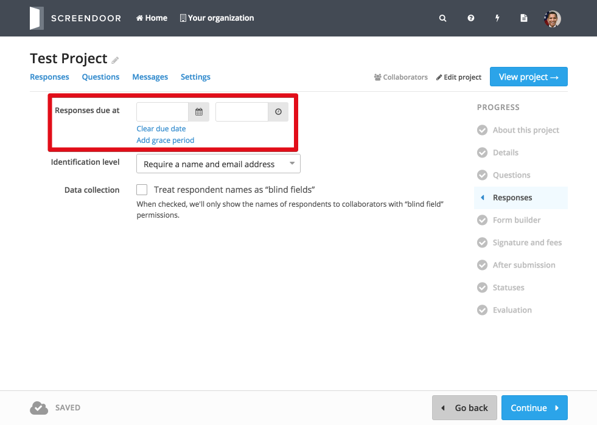
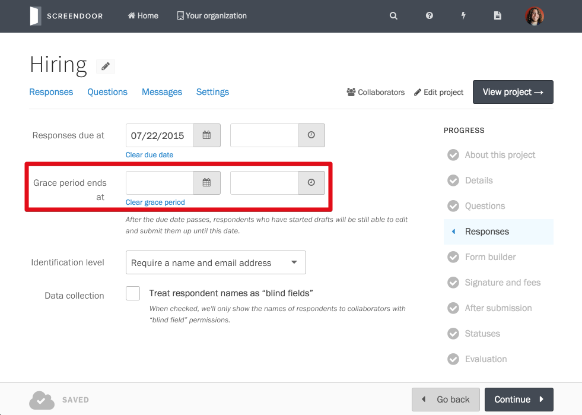

To configure preferences for responses, click "Edit project" and select "Responses" from the Project Checklist.

## Adding a response due date

Set a deadline for responses by selecting a date from the date/time picker.

If you need to extend the due date, simply return to this page and select a new date (You can also [extend the due date for a specific response](../responses/viewing_unsubmitted_responses.html#extending-the-due-date-for-a-specific-response)). To clear the due date and allow all responses, click the "Clear due date" link.

### Adding a grace period

To add a grace period, click "Add grace period" and select a date from the date/time picker. After the response due date has passed but before the grace period ends, respondents will be able to submit their pre-existing drafts but will not be able to create new responses. 

## Respondent identification

By default, Screendoor will collect names and email addresses from respondents. If a respondent is registered with Screendoor, their name and email address will automatically be collected based on their registration information. Otherwise, they'll be asked to enter this information manually.

If you'd like to require your respondents to create a Screendoor account before submitting responses, select "Require a Screendoor account" under "Identification level."

### Don't collect names and email addresses

If you don't want to collect names and email addresses from your respondents (or if you want to collect them via your own custom fields) select "Keep responses anonymous" under "Identification level."

To learn more about respondent identification, see the [Identification fields FAQ](identification_fields.html).

## Data collection

### Hiding respondent names

To stop your collaborators (other than those with "blind field" permissions) from viewing respondents' names, check the "Treat respondent names as 'blind fields'" box. This will allow you to collect respondents' names while keeping this information from your collaborators/reviewers.

---

## F.A.Q.

### What time zone will the response due date be set in?
The response due date will be set in your current local time zone. The date/time will automatically be presented to users based on their own local time zone. For example, if you set the due date to 4:00pm and you are in the Pacific Time Zone, users on the East Coast will see the due date as 7:00pm.
