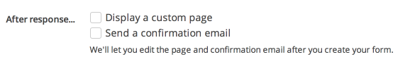

To configure preferences for responses, click "Edit project" and select "Responses" from the project checklist.

## Adding a response due date

Set a deadline for responses by selecting a date from the date/time picker.

If you need to extend the due date, simply return to this page and select a new date (You can also [extend the due date for a specific response](../responses/viewing_unsubmitted_responses.html#extending-the-due-date-for-a-specific-response)). To clear the due date and allow all responses, click the "Clear due date" link.

### Adding a grace period

To add a grace period, click "Add grace period" and select a date from the date/time picker. After the response due date has passed but before the grace period ends, respondents will be able to submit their pre-existing drafts but will not be able to create new responses. 

## Data collection

### Names and email addresses

By default, Screendoor will collect names and email addresses for all respondents. If the respondent is registered with Screendoor, their name and email address will be automatically collected based on their registration information. Otherwise, respondents will be asked to enter this information manually.

If you don't want to collect names and email addresses from your respondents (or if you want them to be anonymous), check the "Do not collect names or email addresses" box.

### Requiring signatures

If you'd like to require an electronic signature from your respondents, check the the corresponding box. To learn more about signatures, check out the [Signatures](signatures.html) article.

### Hiding respondent names

To stop your collaborators (other than those with "blind field" permissions) from viewing respondents' names, check the 'Treat respondents names as "blind fields"' box. This will allow you to collect respondents' names while keeping this information from your collaborators/reviewers.

## Payments

Screendoor enables you to easily receive credit card payments from your respondents via [Stripe](https://stripe.com/). Check out the [Payments](payments.html) article for more information.

## After response

### Displaying a custom "after response" page

To display a custom page to respondents after they submit their response, check the "Display a custom page" box. You can then write and preview your custom page under "After response page" in the project checklist.

### Sending a confirmation email

To send a confirmation email to respondents after they submit their response, check the "Send a confirmation email" box and then write your custom confirmation email under "After response email" in the project checklist.

---

## What time zone will the response due date be set in?
The response due date will be set in your current local time zone. The date/time will automatically be presented to users based on their own local time zone. For example, if you set the due date to 4:00pm and you are in the Pacific Time Zone, users on the East Coast will see the due date as 7:00pm.
