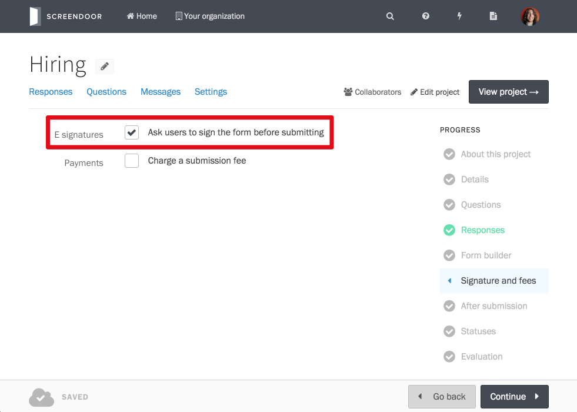
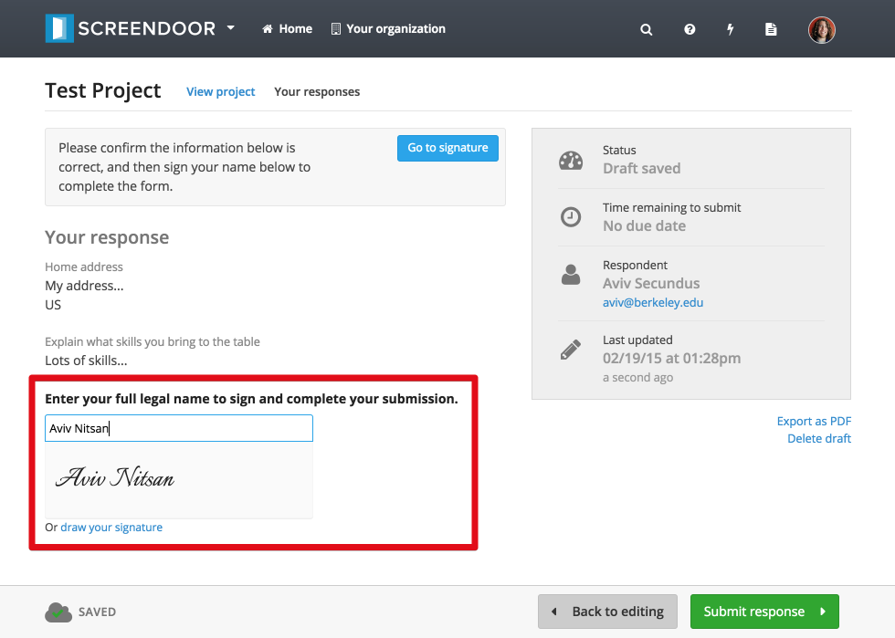
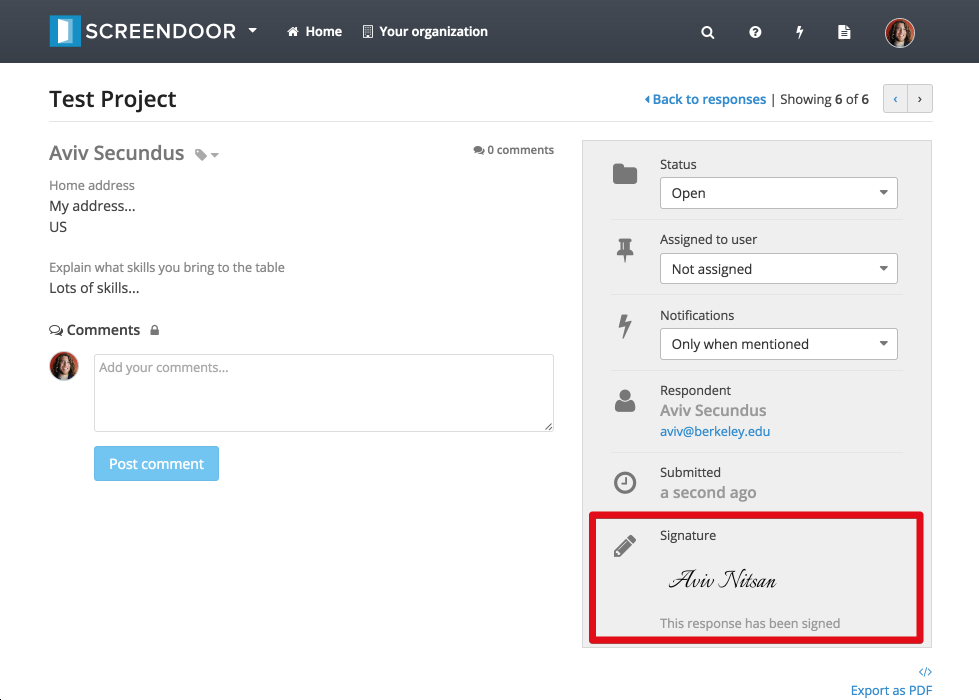
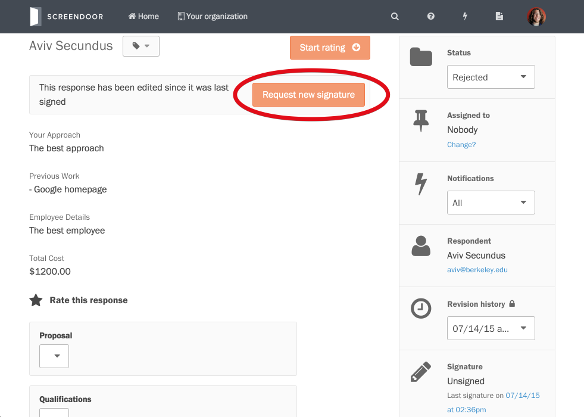

## Enabling electronic signatures

To enable electronic signatures for your project, click "Edit project" and select "Signature and fees" from the "Progress" menu. Then, check the "Ask users to sign the form before submitting" box.

That's it! Respondents will now be required to sign their response before submitting it.

## Viewing signatures

Once a response is signed, you'll be able to view the signature from the individual response page.

You can also view whether or not a response has been signed from the "Responses" table for your project.

Also, when you export a response as a PDF, the signature will appear in that PDF.

---

## What happens if a respondent makes changes to their response after signing?
Any time a respondent makes changes to a response that requires their signature, they'll have to re-sign it. This way, every change will be "signed."

## What happens if I make changes to a response after it's been signed?
If you (or another admin) make changes to a response after the respondent has signed and submitted it, you'll have to request that they sign it again if you want the new version to be signed.

To request a new signature, click the "Request new signature" button from the individual response page. The respondent will then be notified that you have requested them to sign the updated response. Once they sign off on your changes, the response will appear again as "signed."
