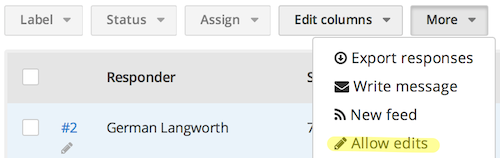
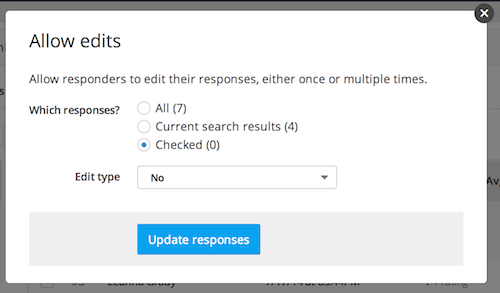

## Allowing edits to multiple responses

If you'd like your respondents to be able to edit their responses after they have submitted them, click "Allow edits" from the "more" dropdown above the "Responses" table.

You can then allow edits for all respondents (the "All" checkbox), for the respondents displayed in the current search results (the "Current search results" checkbox), or for the respondents you have selected by checking the box next to their name in the "Responses" table (the "Checked" checkbox).

After you have chosen which responses to enable for editing, select either "Yes" or "Once" from the "Edit type" dropdown. "Yes" will enable multiple edits, while "Once" will only allow the respondent to edit their response one time. Then, click "Update responses" to save your configuration. Note that you can always go back and disable response editing by selecting "No" from the "Edit type" dropdown.

## Allowing edits to a specific response

If you just want to allow edits to one response, you can do so from the individual response page. From the "Responses" page, click on the response you'd like to allow edits to. This will bring you to the details page for that specific response. Select either "Yes" or "Once" from the "Allow edits" dropdown.

