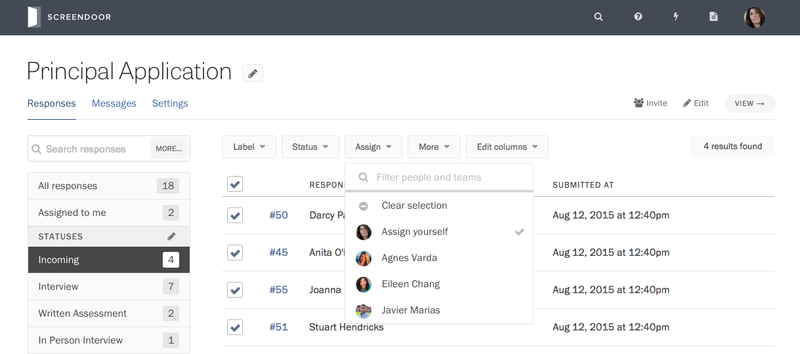
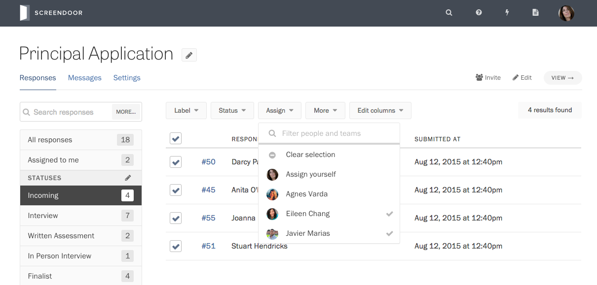
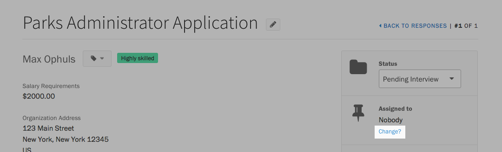

It feels great when people are interested in your project. But if you receive too many responses for one person to manage, it can be tough to know where to start. Screendoor lightens your workload by letting you assign responses to your colleagues for review.

From your project's Responses page, select what you want to assign using the checkboxes on the left side of the table. Press the &ldquo;Assign&rdquo; button above the table, and select at least one of your collaborators from the dropdown. Click anywhere outside the dropdown to apply your changes.

You can simultaneously assign responses to as many people as you want. For example, if you are running a fellowship program through Screendoor and you'd like at least two of your colleagues to review each application before you follow up, you can assign those two colleagues at the same time, instead of one after the other.

To speed up this process a bit, you can use the search bar at the top of the dropdown to find exactly who you're looking for.

You can also assign a response while you are reading it. First, click on a response in the table to view it. Then, in the sidebar, under &ldquo;Assigned to,&rdquo; click the &ldquo;Change?&rdquo; link and select your assignee(s) from the dropdown.

If your organization is on a Standard plan or above, you can also assign responses to [teams](/articles/screendoor/collaboration/teams.html).

