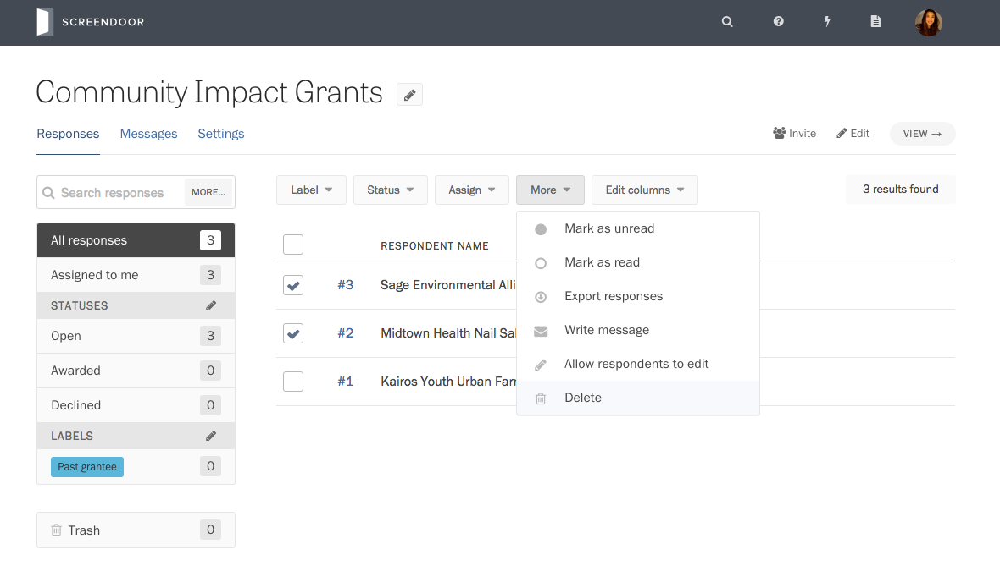
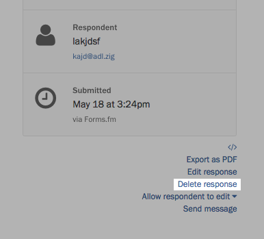
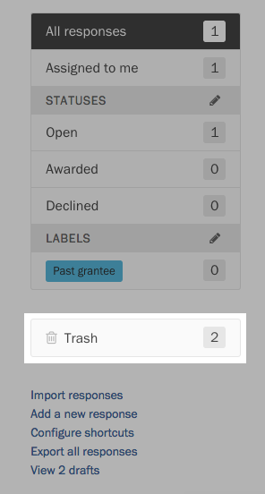
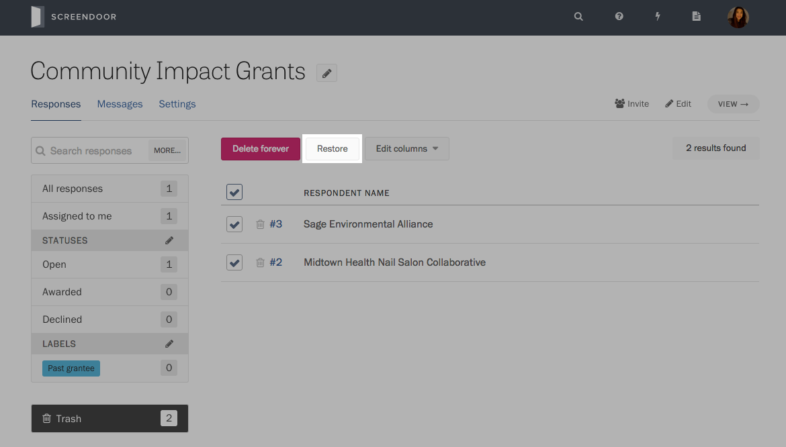
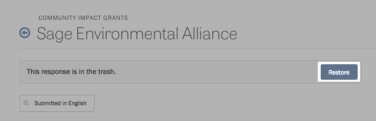
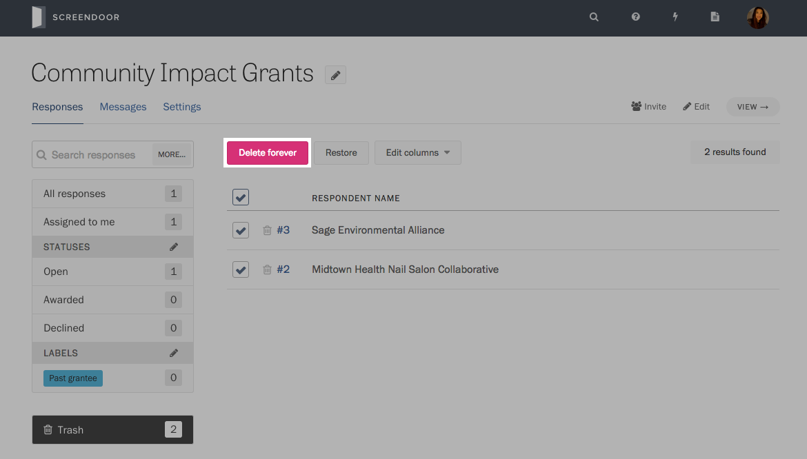
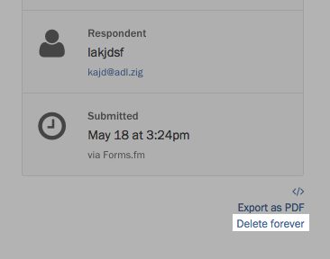
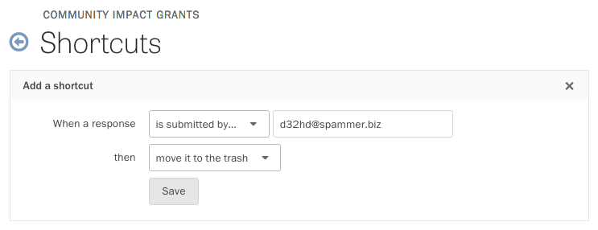

When you delete a response from your project, it goes to the trash. This lets you remove duplicate, erroneous, or spam responses without fear of deleting data by mistake. If you ever change your mind about a trashed response, you can restore it. Or you can choose to delete it permanently.

### Moving a response to the trash

From your project’s Responses page, use the checkboxes on the left side of the table to select the responses you want to send to the trash. Press the More button above the table, and select Delete from the dropdown.

You can also send a response to the trash from its detailed view. In the lower right-hand side of the page, click "Delete response."

To view responses in the trash, visit your project’s Responses page and click Trash in the left sidebar.

### Restoring a response from the trash

First, visit your project’s Responses page and click Trash in the left sidebar. Then, you can use the checkboxes on the left side of the table to select the responses you would like to restore. Press the Restore button above the table to move these responses back to the main table.

To restore an individual response from its detailed view, press the Restore button at the top of the page.

### Permanently deleting a response

To permanently delete a response, visit your project’s Responses page and click Trash in the left sidebar. Use the checkboxes on the left side of the table to select the responses you would like to permanently delete. Then, press "Delete forever" above the table.

You will be asked whether you're sure you want to delete these responses. Press Delete.

You can also permanently delete a response while you are reading it. In the lower right-hand side of the page, click "Delete forever."

---

## F.A.Q.

### How do I block someone from submitting to my form?

You can create a shortcut that sends responses from a specific email address to your project’s trash. This will keep them separate from the other responses.

To configure this shortcut, go to your project's Responses page and click "Configure shortcuts" in the lower left-hand corner. Click "Add shortcut." In the dropdown of triggers, select “is submitted by...” Then, enter the email address in the adjacent field. In the dropdown of actions, select “move it to the trash.”

