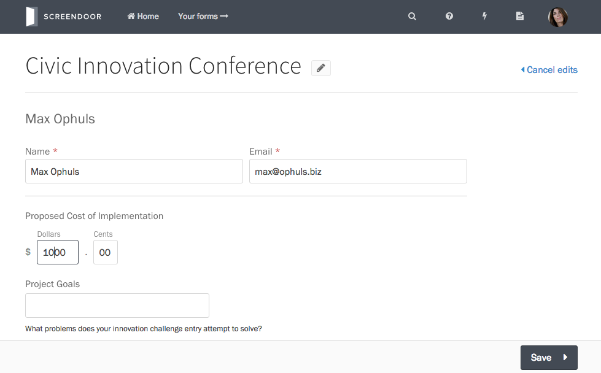

### Editing a response yourself

If you need to edit a response, Screendoor makes it easy to do so. On your project's Responses page, click on a response in the table to view it. In the lower right-hand side of the page, click the "Edit response" link.

Make your changes inside the form. When you're done, press the Save button in the bottom right corner to apply your edits.

### Asking respondents to edit

[Read more about allowing respondents to edit here.](/articles/screendoor/responses/providing_support_to_respondents.html)

### Viewing previous revisions

When you edit a response, Screendoor maintains a _revision history_, archiving the old version so you can maintain an audit trail.

To view an old revision, click on the dropdown under "Revision history" in the response's sidebar, and select the revision you would like to view.

When you are viewing an old revision, you have the option to make it the current version. Press the "Restore this version" button at the top of the response.

