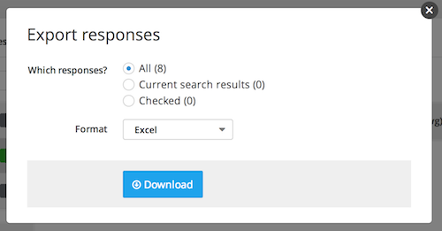

## Exporting responses

To export responses from your project, navigate to the "Responses" page for you project, click "More" on the toolbar, and select "Export responses."

From the "Export responses" popup, select which responses you'd like to export. Then, select the format you'd like to export them as, and click "Download" to begin the export process.

Depending on the format you've selected, Screendoor may email you a link to download your exported responses. If it does, just click the link in the email to download your responses.

---

## Can I export my entire project?
If you'd like to export a *complete* set of data for your project (as JSON files), you can do so from the "Settings" page. Just click the "Export project" link and then click the "Generate export" button from the popup. Note that Screendoor will process your export request and then send you an email with the download link once it's done.

