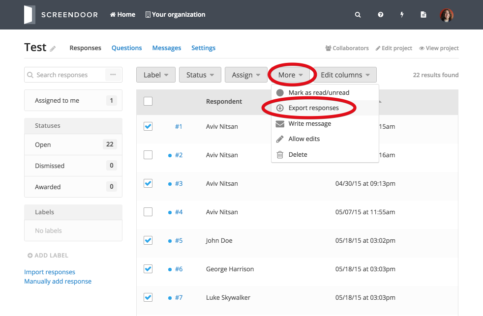
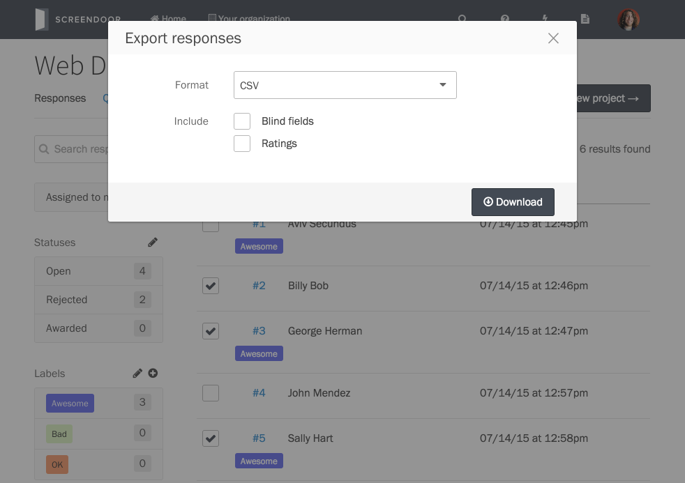
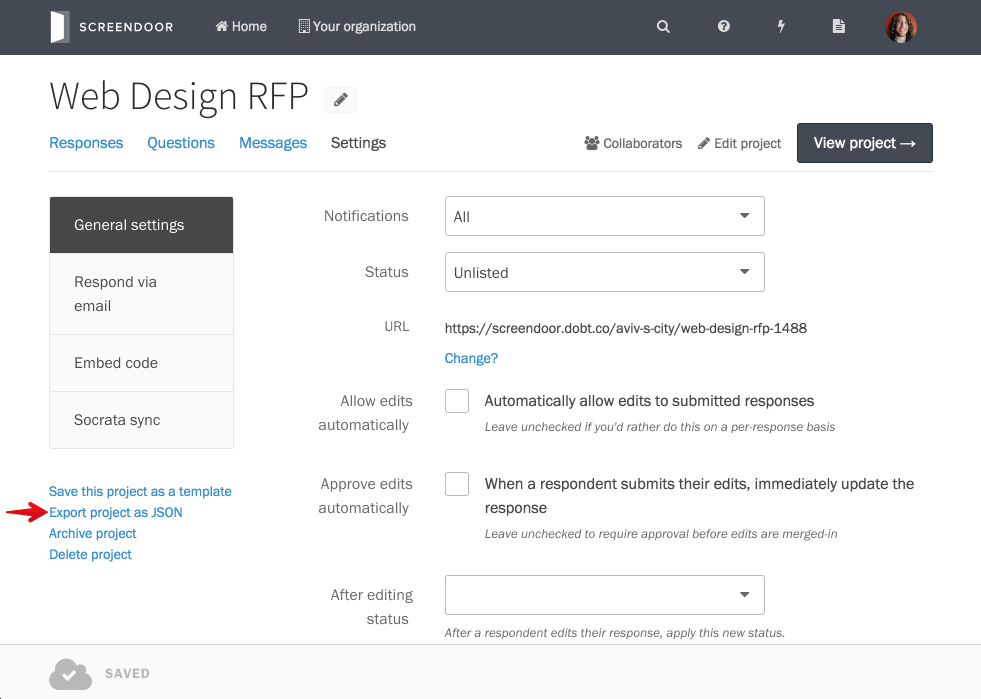

## Exporting responses

To export responses, navigate to the "Responses" page for you project. Check the boxes next to the responses you'd like to export. Then, click "More" on the toolbar and select "Export responses" from the dropdown.

From the "Export responses" popup, select a format and optionally include blind fields and ratings (if you have the appropriate permissions). Then, click "Download" to begin the export process.

Depending on the format you've selected, Screendoor may email you a link to download your exported responses. If it does, just click the link in the email to download your responses.

## Exporting all responses

To export all responses, check the topmost box and click the "Select all results" link if you have more than one page of responses.

Then, click "More" and select "Export responses" from the dropdown (see above).

---

## F.A.Q.

### Can I export my entire project?
If you'd like to export a *complete* set of data for your project (as JSON files), you can do so from the "Settings" page. Just click the "Export project as JSON" link and then click the "Generate export" button from the popup. Note that Screendoor will process your export request and then send you an email with the download link once it's done.

