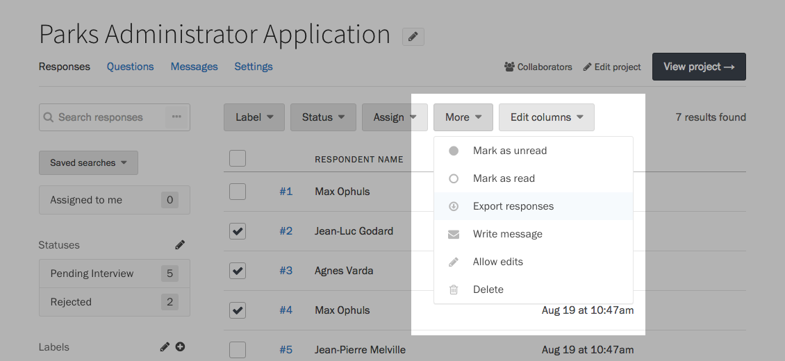

### Exporting responses

When you sign up for a Screendoor account, you can have peace of mind in knowing that you own your data. We let you export all of your Screendoor data at any time, in open formats.

To export responses, visit your project's Responses page, and using the checkboxes on the left side of the table, select the responses you wish to export. Press the &ldquo;More&rdquo; button above the table, and choose &ldquo;Export responses&rdquo; from the dropdown.

A modal dialog will appear. Under Format, choose how you would like to receive your export: Excel, CSV, or PDF. If you have the appropriate permissions, you can also choose whether to include [blind fields](/articles/screendoor/evaluation/removing_bias.html) or [ratings](/articles/screendoor/evaluation/configuring_evaluation_fields.html) in your export.

By default, exports do not contain uploaded attachments. If you want to export files uploaded from your respondents, select &ldquo;Attachments&rdquo; from the Format dropdown.

Once you have configured your export, press the &ldquo;Download&rdquo; button to begin the export process.

### Exporting all responses

You can export all of your responses in a single click. On your project's Responses page, click the &ldquo;Export all responses&rdquo; link in the lower left-hand corner.

---

## F.A.Q.

### Can I export all the data from my project?

You can export all data for your project, including forms, ratings and project settings, as JSON files. To do so, visit your project's Settings page and click the &ldquo;Export project link as JSON&rdquo; link in the lower left-hand corner.

A modal dialog will appear asking you to confirm your action. Press the &ldquo;Generate export&rdquo; button to begin the process. Once the JSON files have been generated, Screendoor will send you an email with the download link.
