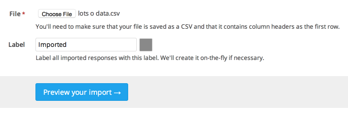
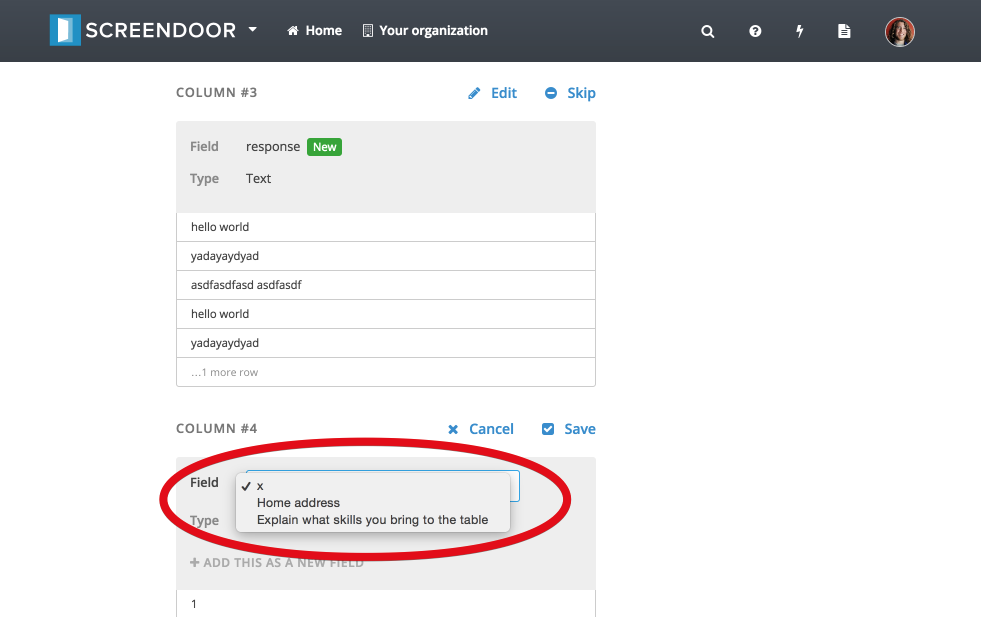

To import responses from a [CSV](http://en.wikipedia.org/wiki/Comma-separated_values) file, click "Import responses" box from the left-hand side of the "Responses" page. Then, select your CSV file, optionally add a label that will be applied to all imported items, and click the "Preview your import" button to begin the import process.

## Importing columns that correspond to existing response fields

From the preview page, you can configure how you want your responses to be imported. Screendoor will make an intelligent guess about which columns in your CSV file correspond to which response fields in your form -- you'll see a blue "Existing" label next to columns that Screendoor has associated with an existing response field. But you can also manually change the response field for a column by clicking the "Edit" button, clicking "Import to existing field," and selecting a field from the dropdown.

You can even add a column as a new response field: Just click "Add this as a new field" and select the field name and type you'd like to import your column as. Remember to click "Save."

## Importing columns as new response fields

If Screendoor doesn't find a response field that corresponds to a column in your CSV file, it will give you the option to create a new field -- you'll see a green "New" label next to it. You can edit this new field's name and type, and even decide to add it as an existing field instead.

Finally, if you would like to skip importing a specific column, simply click "Skip" and it won't be imported.

When you're done configuring your import, click "Finish import."

---

## F.A.Q.

### I have my data in an Excel file. Can I get it into Screendoor?
Yes! Save your data as a CSV file from Excel. Then you can easily import it into Screendoor (see above).
