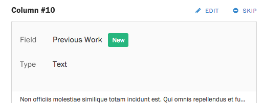
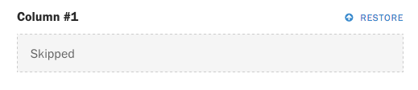

If you are switching to Screendoor from a third-party service or you need to migrate your data to another Screendoor account, you can import responses into your project to keep all of your data in the same place.

### Getting Started

First, make sure your responses are formatted as a CSV file. Most third-party form services allow you to export to CSV, but you can also create a CSV from a spreadsheet program like Excel. Each form field should occupy a column of your spreadsheet, and each response should occupy a row.

Here's an example of what your spreadsheet should look like:

| Respondent name | Respondent email    | Question #1 | Question #2 |
|-----------------|---------------------|-------------|-------------|
| Max Ophuls      | m.ophuls@ophuls.biz | (Answer)    | (Answer)    |
| Debra Granik    |                     | (Answer)    | (Answer)    |

Once you have your CSV, go to your project's Responses page and click &ldquo;Import responses&rdquo; in the lower left-hand corner.

Under &ldquo;File,&rdquo; select the CSV you would like to import, and press &ldquo;Preview your import.&rdquo; If you want to distinguish imported responses from those collected through Screendoor, specify a label on this screen as well. If the label does not yet exist, we'll create it for you.

### Previewing your imported CSV

Once your file has been uploaded, you will be taken to the Preview page. Screendoor makes an educated guess about which columns in your CSV correspond to your existing form fields and attempts to match them up. The Preview page gives you the chance to confirm or fix those guesses.

Columns can be categorized as either Existing , New , Skipped , or Screendoor fields .

An Existing column matches a field that is already in your form and will be imported as an answer to that field. Screendoor fields match a special, Screendoor-specific piece of information: for example, if your CSV has a column named &ldquo;Status,&rdquo; the contents of that field will be added as the response's status in Screendoor.

A New column doesn't match any of the existing fields in your form and will be added as a new field at the bottom of your form. In this example, a text field with the label &ldquo;Previous Work&rdquo; will be added to your form.

A Skipped field will not be imported into your project. Screendoor usually decides to skip fields automatically only if the column is blank.

If you're importing data from another Screendoor project, columns might also be skipped because they contain a Screendoor-specific field that shouldn't be imported (like &ldquo;Response ID&rdquo; or &ldquo;Response Number&rdquo;).

### Editing your imported columns

You can manually edit any column on the preview page to link to a form field of your choice.

To remove any column from your final import, click the Skip link in the upper-right corner of the column.

To make any other changes, click the Edit link.

When editing an Existing column, you can choose to map it to an existing form field with the Field dropdown, or click the &ldquo;Add as New Field&rdquo; link to convert it to a New field.

When you are editing a New field, you can edit both the label and the field type, or click the &ldquo;Import to Existing Field&rdquo; link to convert it to an Existing field.

Finally, you can click the Restore link on any skipped column to include it in the import.

Once everything looks good, press the &ldquo;Finish import&rdquo; button at the bottom of the page. If your import is successful, you will be redirected to the Responses page, where you will see a success notification.

We import your responses in the background, so it might take a few minutes for you to see them. Don't worry: they should show up in your Responses page within a few minutes.

### Importing to Screendoor fields

When mapping a column to a Screendoor field, it's important to format its values correctly. Here's how you should format Screendoor-specific information:

| Screendoor field | Format | Example | Notes |
| --- | --- | --- | --- |
| Respondent name | String | `"Max Ophuls"` | |
| Respondent email | String | `"max@ophuls.biz"` | |
| Status | String | `"Open"` | The status must already exist inside of the project. |
| Labels | Comma-separated | `"A+, Missing info"`| If a label does not exist, it will be created for you. |
| Assigned to | Comma-separated | `"Barack Obama, HR"` | The list can contain names of individual collaborators, as well as names of [project teams](/articles/screendoor/collaboration/teams.html). |
