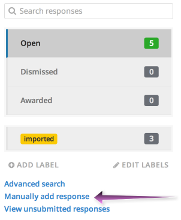

If you need to manually enter response information for someone, you can manually add a response by clicking the "Manually add response" link from your main "Responses" page.

Note that responses you create manually will not be validated, and will not trigger notifications. This means that you can leave out required fields and still submit the form without seeing any errors, and that the usual notifications will be skipped.
