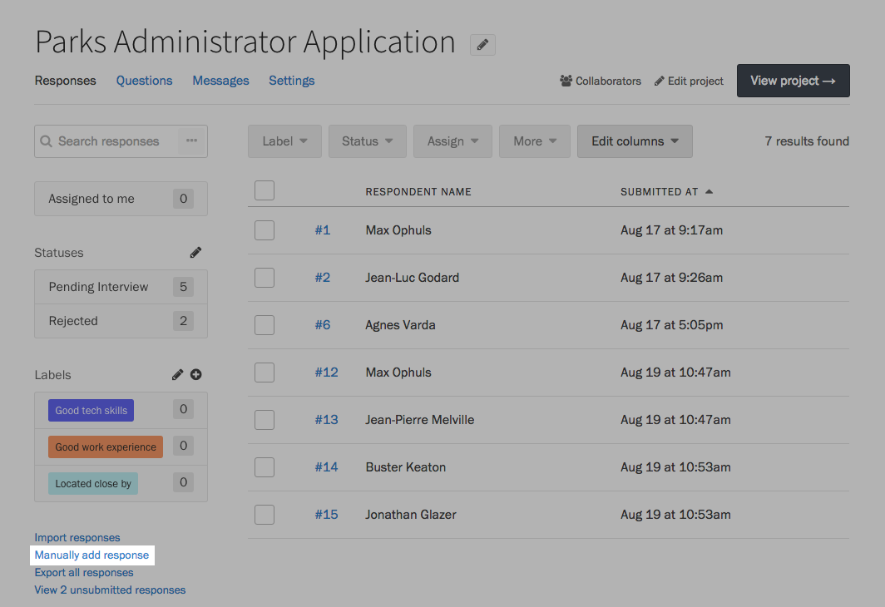

Sometimes your respondents might not have access to your form: they'll need to submit a version on paper, email the answers to you, or dictate it over the phone. Screendoor gives you an easy way to enter a response under that person's name, without needing to sign out of your account.

### Manually adding a response to a Screendoor project

On your project's Responses page, click the &ldquo;Manually add response&rdquo; link in the lower left-hand corner.

Fill out the form, and make sure to enter that person's name and email! Press the Submit button when you are finished.

    **Note:** Required fields are _not_ validated when you manually enter a response. If you're transcribing a response that is only partially complete, you can leave as many fields blank as you wish without encountering errors.

